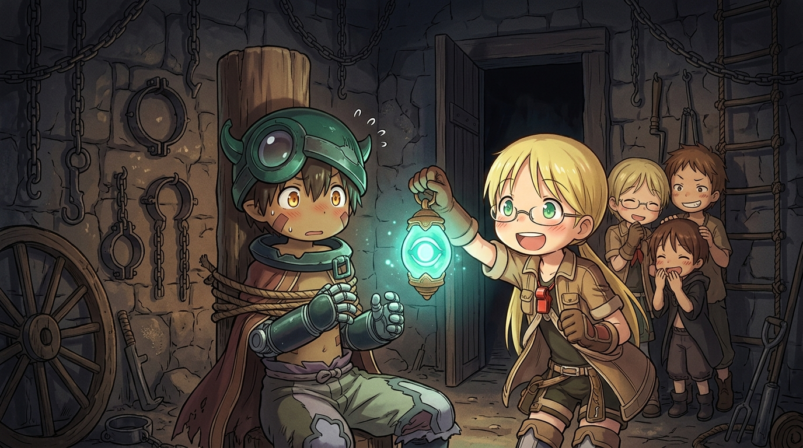

# 🖼️ 滿牆刑具的靈魂發問·拷問室裡的初次邂逅 (Soul Question Amid Iron Chains: The First Encounter in the Torture Room)

靈感來自《來自深淵》（nim-made-in-abyss）第 1 話。

在貝爾切洛孤兒院過去作為刑訊室的幽暗房間裡，青綠色的發光遺物提燈投下奇幻的光影。粗重的生鏽鎖鏈、鐵製頸圈、鐐銬與帶刺木輪懸掛在斑駁石牆上。剛剛因為同伴「將電擊刻度 2 誤調成 20」而抽乾全鎮電網、在雷霆電弧中甦醒的機械少年雷格，正被五花大綁固定在木柱中央。

面對眼前雙眼冒出興奮綠色十字星光、雙手托腮湊上前來的大膽金髮女孩莉可，以及在門邊竊竊私語的偷聽小分隊（納德、席奇、小裘伊），全身具備頂級防禦與超常機能的機械少年，流著冷汗露出了極度困惑且靦腆的表情，認真問出了全話最爆笑的神級台詞：

「你們的工作……是專門拷問別人的嗎？」

這段極具黑色幽默的神來之筆，將地表成人嚴苛的體罰與沒收體制，反襯成孩童們毫無心機的秘密冒險。在深淵宏大壯烈的世界觀底下，這群少年少女用無可救藥的莽撞、好奇與純粹義氣，為整座深淵注入了最鮮活明亮的靈魂。

