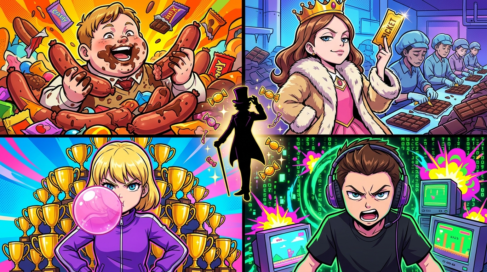

# 🖼️ 四重人格的慾望之鏡·四張金券的人性狂想

### 創作靈感與觀影感悟
本作品源自《查理和巧克力工廠》（*film-charlie-chocolate-factory*）第 1 話中對前四位金色獎券得主的人性剖析。提姆·波頓以極其犀利而荒誕的手法，展現出每一張金券如何被不同的社會異化力量所奪取：
1. **暴食之子·奧古斯都（Augustus Gloop）**：滿臉糊著巧克力，在杜塞道夫的肉舖中以一天數十塊的食慾暴力砸出統計必然；
2. **資本特權·維露卡（Veruca Salt）**：身穿皮草的富家千金，動用父親整座堅果工廠的女工產線日以繼夜剝開數十萬張包裝紙；
3. **病態好勝·薇奧萊特（Violet Beauregarde）**：嚼著口香糖的空手道常勝軍，將金券視為自己 263 座獎盃之外的另一座戰利品；
4. **算力虛無·麥克·蒂維（Mike Teavee）**：沉迷暴力電玩的電腦神童，透過日經指數導數與出廠日期精準破解金券位置，卻對糖果充滿蔑視。

### 核心象徵與哲學提煉
- **四種分母的暴力**：這四位孩子分別調動了「肉體慾望」、「階級資本」、「競賽虛榮」與「純粹資訊」，將隨機抽獎扭曲為資源的霸權。
- **家庭共犯與考驗的前奏**：每個畸形孩子的背後都站著推波助瀾的父母；中央威利·旺卡的神秘剪影預示著，這四張金券不是通往天堂的門票，而是一座即將對人性缺陷展開嚴厲審判的奇幻法庭！

