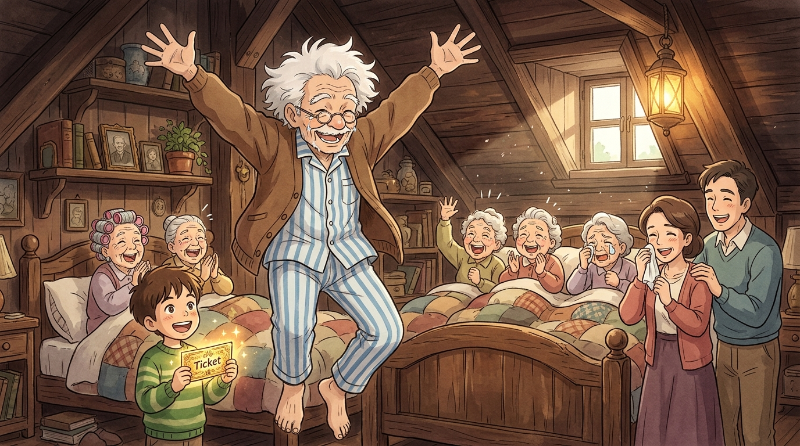

# 🖼️ 加總381歲的奇蹟之躍·床頭金券狂喜起舞

### 創作靈感與觀影感悟
本作品源自《查理和巧克力工廠》（*film-charlie-chocolate-factory*）第 1 話最具感染力的高潮時刻。查理用拾得的紙鈔買下最後一塊旺卡巧克力，並在包裝紙下赫然發現了全世界最後一張「金色獎券（Golden Ticket）」。當他氣喘吁吁衝回破木屋、將金券交給二十年未曾下床的喬爺爺時，整個家庭的命運被徹底點亮。

畫面定格在喬爺爺雙腳踩在木地板上、如孩童般興奮躍起起舞的奇蹟瞬間。查理高舉散發金色輝光的獎券，四位加總 381 歲的祖父母與父母在溫暖的油燈光暈中歡呼雀躍、喜極而泣，將全片的溫情與希望推向頂點。

### 核心象徵與哲學提煉
- **床頭的共謀與奇蹟的兌現**：喬爺爺拿出私房銀幣對查理說「我們倆放手一搏」，不是盲目的賭徒心理，而是在困頓絕境中守護夢想的最後尊嚴；二十年的臥床沉寂在金券的光芒下一掃而空。
- **遺囑與希望的合流**：祖母在床邊曾對查理說過「世間一切皆有可能」；這一躍不僅是身體機能的復甦，更是貧寒家庭在愛的庇護下迎來命運破曉的壯麗象徵。

