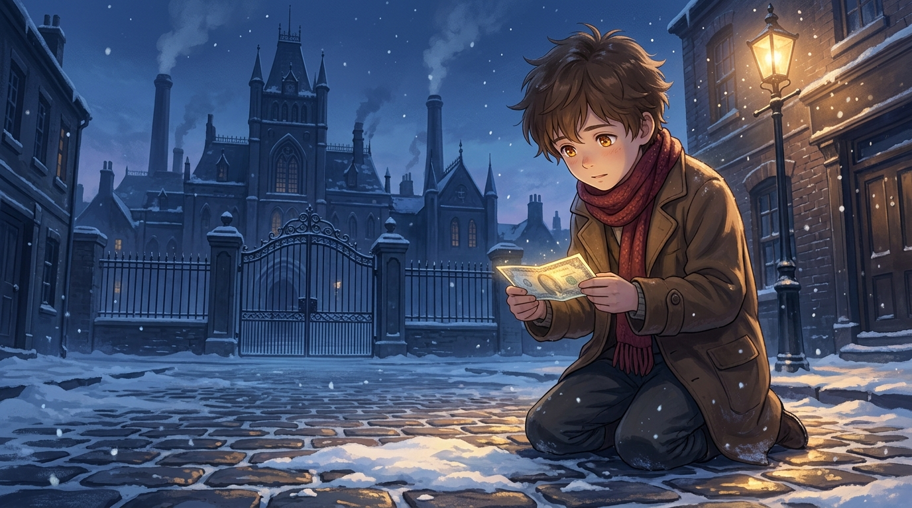

# 🖼️ 雪夜工廠外的紙鈔奇蹟·命運的純真召喚

### 創作靈感與觀影感悟
本作品源自《查理和巧克力工廠》（*film-charlie-chocolate-factory*）第 1 話的觀影心得。在寒冬蕭瑟的工業小鎮中，遠方矗立著煙囪參天、鐵門緊鎖的威利·旺卡巧克力工廠；近景則是查理一家傾斜貧寒的小木屋。當全家人用僅存的微薄積蓄買下的生日巧克力落空、父親因蛀牙風潮引發的牙膏廠機械化而失業時，命運以最不可思議的方式在雪地中投下了轉折的種子。

畫面捕捉小查理裹著破舊大衣與紅色圍巾，在工廠鐵門外的冰冷石板路雪窪中拾起半埋紙鈔的一刻。透過深藍冷冽的夜色與溫暖街燈的對比，展現出「世界的分母無比殘酷，但純粹的善良終將迎來奇蹟」的心靈震撼。

### 核心象徵與哲學提煉
- **雪地中的微光**：前面的得主依靠暴食、特權資本與演算法算力掠奪金券，而查理走向最後一張金券的契機，卻是毫無心機的「雪地拾遺」。
- **純粹的分子**：在全世界每天消耗數百萬塊巧克力的龐大分母面前，查理是唯一一位將「1/1」的生日禮物切成六份分給全家的人；這張紙鈔不是幸運，而是對純真靈魂的必然獎賞。

