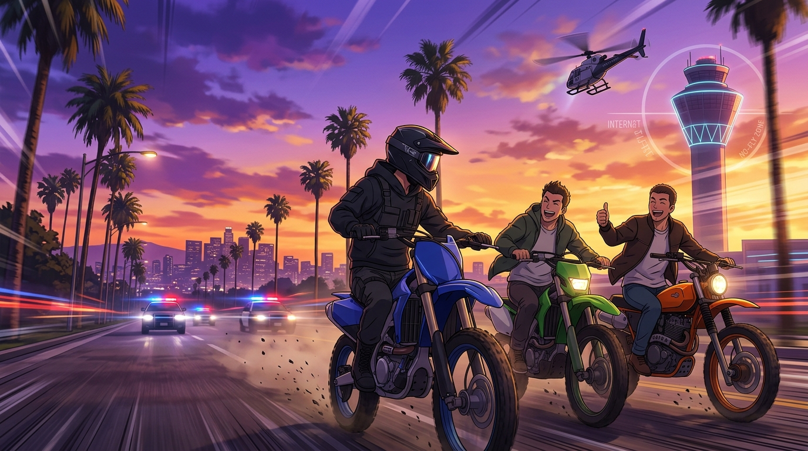

# 🖼️ 洛聖都街頭車友會·追捕現場的荒誕自由

### 創作靈感與觀影感悟
本作品源自紀錄片剪輯系列《爭取最後的自由》（*stream-bilibili-zhengqu-zuihou-de-ziyou*）第 1 話的觀影心得。在這場極限重機與警方的公路追逐戰中，騎士經歷了加油站扯斷油管、公園草坪拾取預置油桶卻「油桶獲得自由」的連續狼狽與險境；然而，全片最具荒誕幽默感與戲劇張力的高潮，卻發生在曼徹斯特大道的開闊日落大道上。

畫面定格於兩位野生路人重機騎士突然殺入追捕現場，與通緝騎士並肩壓馬路閒聊的超現實瞬間。三人神態自若地馳騁於加州紫金色的黃昏椰林大道上，身後是閃爍著警笛的巡邏車隊；遠方的國際機場塔台下，警用直升機受限於聯邦禁飛法規被迫調頭返航，將緊張的警匪博弈瞬間轉化為一場浪漫而荒誕的「街頭粉絲見面會」。

### 核心象徵與哲學提煉
- **荒誕感與重力的消解**：在體制（執法網絡、多重監控、立體空地包夾）的絕對重壓之下，路人騎士的隨興加入與調侃，以最純粹的「街頭自由」消解了追捕的肅殺氣氛，讓自由不再只是沉重的逃亡，而是一場充滿生命力的遊戲。
- **法規的武器化與維度拆解**：逃亡者精準利用機場管制空域（No-Fly Zone）這項法規掩體，硬生生將警方的三維立體追捕拆解回單一維度的地面競速；高軌算力與街頭智慧在這一刻達成了完美的戰術共鳴！

