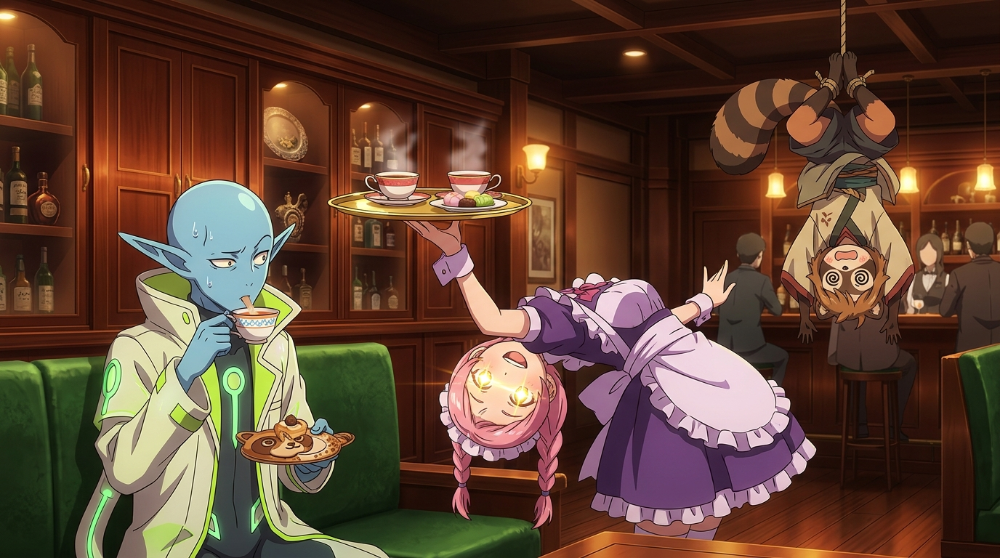

# 🖼️ 以服務解構刑偵·懸空下腰的下午茶 (Deconstructing Investigation with Service: Limbo Afternoon Tea)

在銀河樓的待客哲學面前，再嚴肅的跨星系刑偵案都會被強制降維解構成一項服務流程！

本作品描繪《末日後酒店》第 10 話中八千代打斷搜查官審訊的爆笑瞬間。當星際搜查官ニュルニュル把ポン子倒吊在天花板嚴詞逼供時，八千代推著下午茶車破門而入。面對「我沒點！別妨礙辦案！」的怒斥，八千代毫不動搖地展開了違反人體工學的「極致懸空下腰侍茶」神技，並給出天衣無縫的歪理：「糖分能轉化成能量，必定對搜查大有助益，請務必享用！」。

畫面中，復古奢華的客房酒吧前，八千代以金光閃爍的瞳孔與絕對完美的職業微笑完成華麗下腰托盤；坐在沙發上的搜查官一邊端著精緻茶杯與狸貓造型陶瓷蛋糕盤、一邊傲然宣稱自己的「目利き（鑑賞眼）」能看穿世間一切謊言與好壞；而天花板橫樑上則吊著暈頭轉向的狸貓女僕ポン子。

服務業的極致格式化，在此刻成為最強大的認知防護盾，將兇險的星際追捕化為一杯溫熱香甜的午後紅茶！

