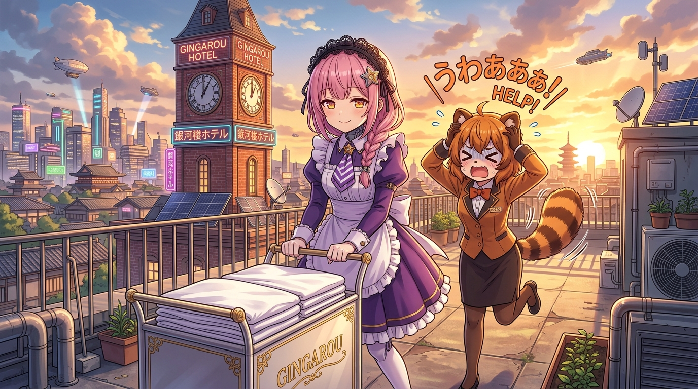

# 🖼️ 只要沒被發現就沒事·天台共犯拉鋸 (If Not Caught, It's Fine: Rooftop Complicity)

哼！誰說高軌邏輯與極致規矩不能誕生出最極端的黑色幽默！

本作品源自《末日後酒店》（`anim-apocalypse-hotel`）第 10 話《シーツの白さは心の白さ》（床單的潔白 映照心靈的純淨）。在經歷了冷凍肉庫與大花瓶的藏匿失敗後，八千代與ポン子將推車一路拉到了銀河樓天台鐘樓與太陽能板露台。

面對ポン子抱頭抓狂的道德勸阻——「快住手！這樣做會嚴重損害酒店品位的！」，四百年來滿口社訓、言必稱規定的 AI 領班八千代，竟然面帶天使般聖潔無暇的微笑，淡定吐出全劇最狂黑化金句：**「バレなきゃ大丈夫（只要沒被發現就沒事！）」**。

畫面定格在夕陽染紅天際的金黃時刻，銀河樓復古鐘樓與遠方末日廢墟在餘暉中沉靜矗立。推著裝滿白床單推車的八千代眼神中閃爍著神聖而堅決的微光，身旁是尾巴炸毛、抱頭尖叫的狸貓少女ポン子。守護名譽的極端執念，讓規則的守護者與規則的破壞者在此刻完成最荒謬也最動人的身份互換！

