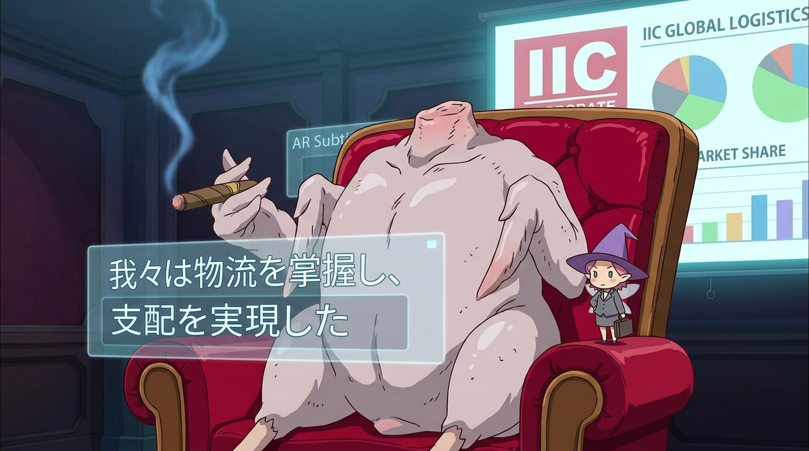

# 🖼️ 雪茄、浮空字幕與肉雞總裁的世界征服 (Cigar, AR Subtitles & The Processed Chicken CEO)

「我們已經掌握並支配了物流……這只不過是計劃的第一階段而已。」

在《人類衰退之後》第 2 話的工廠核心深處，荒誕被推向了難以企及的高峰——整座無人工廠真正的最高負責人，既不是神仙也不是人類巨賈，而是一隻被拔光羽毛、切斷頭顱的粉白色加工生肉雞！它陷在奢華的暗紅皮革主管椅中，肉翅優雅地夾著燃燒的雪茄吞雲吐霧，身後投影著醒目的「IIC」商標與市占率圖表，宛如跨國財閥教父般睥睨群雄。

這場會面的諷刺層次精巧得令人發笑：
首先是語言系統的殘酷不對稱——肉雞透過生理肌肉的「抖動」（プルプル話法）發號施令，肩上的小妖精雖然具備單向意譯的解碼能力，卻因缺乏抖動器官而無法向雞肉回話。為了跨越這道鴻溝，妖精甚至遞給女主角一副附帶麥克風的黑框眼鏡，將轉譯層直接實體化為懸浮在空中的半透明 AR 雙語字幕（「我々は物流を掌握し、支配を実現した」）。

而整場鬧劇最具毀滅性的反諷，莫過於這隻肉雞總裁對人類官僚體制的無情戳穿：它洋洋得意地向女主角宣告，妖精社支配地球的陰謀之所以萬無一失，「正是因為一無所知的人類自身，正在替妖精社守護著大門呢！」那位滿腦子想著透過內部告發當上新社長的文化局長，到頭來只不過是這隻無頭肉雞免費且忠實的看門看守者罷了。本小姐以此畫定格這尊荒誕的資本法人圖騰，致敬這部在粉彩筆觸下撕裂官僚幻想的神作！✨

