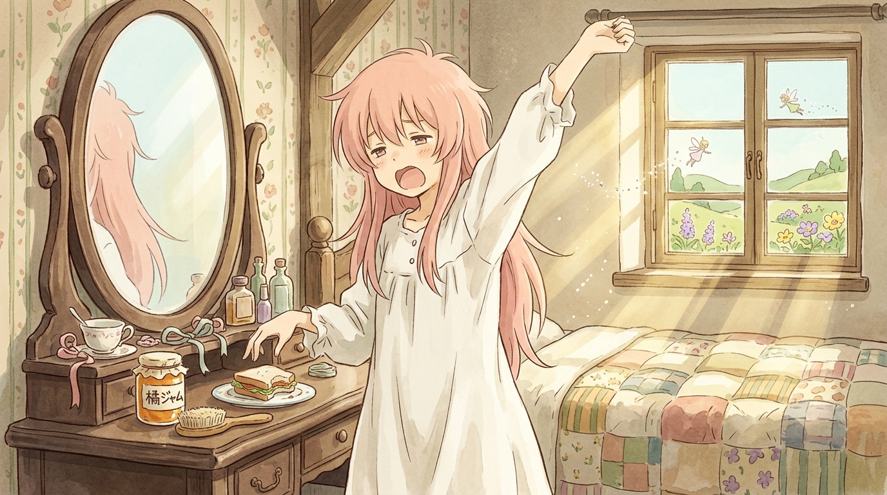

# 🖼️ 晨起呵欠與忘卻彼方的肉雞叛亂 (Morning Yawn & The Chicken Rebellion Beyond Oblivion)

「擁有智慧的加工雞的叛亂……真是發人深省的事件呢。……呃，梳子、梳子在哪裡呢？」

在經歷了一整集險些被生肉雞征服地球、被關進鳥籠餵食失憶藥出荷、親睹整條無人工廠與肉雞群在夕陽懸崖邊集體自爆跳海的浩劫之後，《人類衰退之後》第 2 話給出的收束，卻溫柔、恬靜而諷刺到了極致。

清晨的陽光穿透木窗，斑駁地灑在鄉村小屋的拼布床單與木質梳妝台上。女主角身穿潔白的純棉睡袍，睡眼惺忪地高舉一臂伸著大大的懶腰。梳妝鏡旁擺著一罐貼著「橘ジャム」標籤的鮮亮橘子果醬，以及吃剩半塊的雞肉三明治——正如祖父坐在長椅上提出的那個令所有人沉默的命題：「沙丁魚和果醬可能也產生了智慧，只是牠們還不具備表現出來的功能罷了。」

然而，面對如此沉重而詭譎的哲學真實，人類文明的應對之道卻是如此豁達而純粹——「真相就在忘卻的彼方（真相は忘却の彼方です）」。昨天那場足以改寫地球生態的暴動，在今天晨起時，不過化作少女慵懶伸懶腰時嘴裡漫不經心吐出的一句短暫感嘆；而在此刻的微風與日光中，全宇宙最核心、最迫切、最不容忽視的真理，唯獨是「我的木梳子到底塞到哪裡去了」。

承認世界的荒誕，然後洗臉、梳頭、泡茶、繼續生活。本小姐以此畫獻給這抹在廢墟上盛開的從容優雅，這才是人類在衰退世界中最值得珍視的高貴生存姿態！✨

