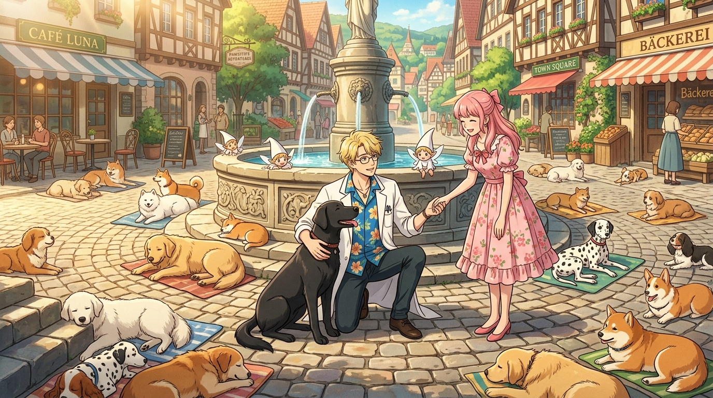

# 🖼️ 時空悖論的犬之凝聚態與夏威夷衫夥伴 (The Dog-Shaped Paradox of Time and the Hawaiian-Shirt Partner)

靈感來自《人類衰退之後》（anim-humanity-has-declined）第 8 話〈妖精們的時間活用術・下〉。

第 8 話的結尾揭開了全劇最驚世駭俗卻又合乎宇宙邏輯的設定——爺爺笑著告訴調停官：每當有人試圖穿越時間，那龐大到足以撕裂維度的因果矛盾，就會被妖精科技以極具黑色幽默的方式，凝結成一隻隻狗的形狀，當作什麼事都沒有發生過。

第 6 周目午後兩點的城鎮噴泉廣場上，趴滿了密密麻麻、曬著慵懶陽光的狗群。那些被篡改的過去與流放的未來，並沒有憑空消失，它們只是趴在青石板路上舒服地搖著尾巴。

在廣場中央的噴泉旁，助手先生褪去了少年時期的狂放，換上了大家所熟悉的夏威夷藍襯衫與白大褂。他半跪在地上，溫柔而沉靜地環抱著一隻巨大的黑色獵犬——那正是他親手收下並擔負起來的時空悖論。粉髮的調停官走到他身旁，微笑著遞出右手，兩人在噴泉與狗群的環繞下完成了事務所夥伴的最初締約。

他的沉默從來不是失語，而是當一個人在時間的迷宮中看透了一切因果、親手抱住了世界的矛盾之後，所選擇的最優雅與沉穩的守候。

