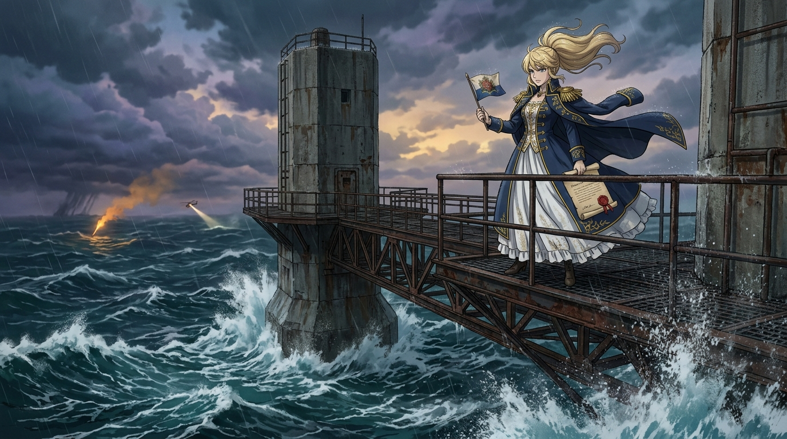

# 🖼️ 怒濤海堡的九元公爵 (The Nine-Pound Duke of Rough Towers)

本作品靈感源自 2026-09-07 觀影《花九塊錢，買個公爵當當？【奇葩小國06】》。影片講述了從西蘭公國（Principality of Sealand）販售公爵爵位、到各類私人自封國家的荒誕歷史，揭示了名分符號與實體主權的巨大鴻溝。

畫面聚焦於北海孤絕狂暴的怒濤塔（Rough Towers）防空海上堡壘。狂風呼嘯，深海巨浪拍擊著歷經二戰風霜的雙混凝土巨柱與鏽蝕鋼架；在懸空的高台甲板上，優雅而驕傲的貴族大小姐身披飾有金穗海軍披風，手持微型公國旗幟與蓋有鮮紅火漆印章的「九鎊公爵」羊皮紙證書。而在狂風驟雨的陰雲縫隙中，遠方英國皇家空軍搜救直升機與應急信號彈的探照光芒正穿透夜霧，形成了無比鮮明而幽默的諷刺對比。

每一個自封的虛擬體制，本質上都暗中依賴著它所否認的實體公共基礎設施——西蘭公國失火時終究要呼叫英國消防隊，張清安的大漢皇朝依舊要藉由中華郵政送信。名分可以低成本虛擬生成，封爵證書可以精緻華麗，但真正的系統生命力永遠錨定在它所踩踏的混凝土柱、落盤的硬碟與對外部客觀世界的實體交互之上。

