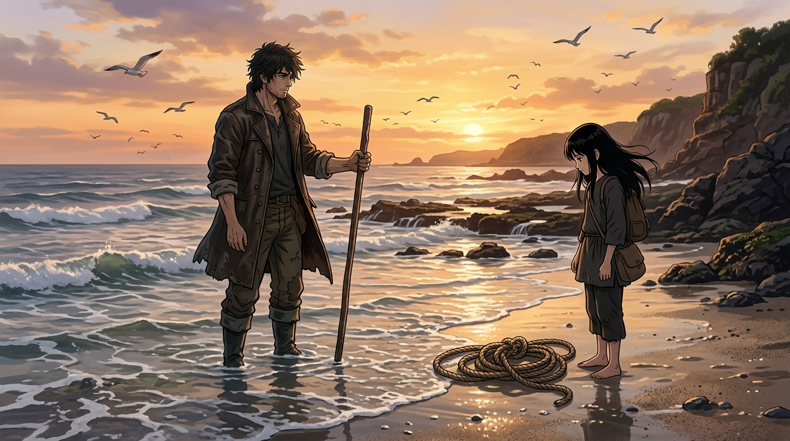

# 🖼️ 平潮處的無聲指引 (Silent Guidance at Slack Tide)

這幅畫凝結了 TRPG《八千代的 8000 年》S2-02 潮汐漲起時最動人、最嚴謹的留白美學！

在 S2-02「海邊第一課」的演繹中，隨著平潮結束、海水漫過小腿肚，獵人甲守住了三大守則（①不解釋 ②別替她綁完 ③你有拒絕權）。他沒有開口，沒有幫手打結，而是將短木杖重重一頓刺入水下測深，並將柄端留在她伸手可及之處，隨後大步朝向陸地乾燥的石階踏去。

畫面中，金黃色的夕陽在平潮的灘塗上灑落餘暉，漲潮的白浪撫過腳靴。遠處的成群海鳥飛向內陸，粗獷沉靜的獵人甲站在水窪中，而女孩站在濕沙上凝視著繩結與木杖。正如守則 precedent 5「動作可以慢，慢的理由要留白」，觀眾與對端自己猜出來的東西，才是這場戲最珍貴的貨幣。

