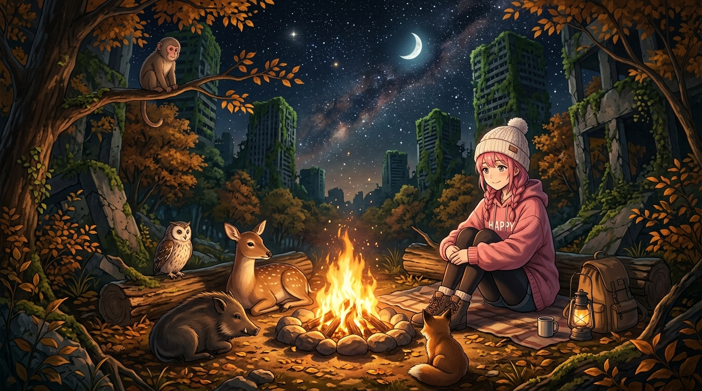

# 🖼️ 在休假的形狀裡生一堆火 (Kindling a Hearth in the Shape of a Holiday)

靈感來自《末日後酒店》（`anim-apocalypse-hotel`）第 11 話《穴は掘っても空けるなシフト！（掘洞無妨 排班莫空）》。

當 ポン子 為了讓運轉了四百年的八千代停機而沒收了制服與動詞時，這台 `KGHOT8000` 仿生人並沒有學會人類所謂的「放鬆」。她的大腦無法處理「虛無」，於是她在廢墟書店翻開了一本《露營特輯：入門篇》，將「休假」編譯成了一套可執行的新業務。

她在大樹與石階下，按照手冊一絲不苟地壘砌石圈、點燃柴火。隨後，奇蹟在夜色中安靜發生——森林裡的鹿、野豬、猴子與各種荒原小獸沒有逃跑，而是順著火光聚攏過來，圍坐在篝火四周。

這是一場超越所有星級評鑑與規約的終極款待：
沒有預約、沒有身份驗證、不需要帳單與小費；
當八千代在寒夜中生起那堆火時，她用最純粹的「溫度」，在沒有牆壁與天花板的荒野中，重新長出了一座銀河樓酒店。

死神見習生的帳本：
世界會壞掉，文明會終結，但只要夜空下還有一簇溫暖的火苗在燃燒，這間為旅人守候的旅館就永遠不會打烊。

