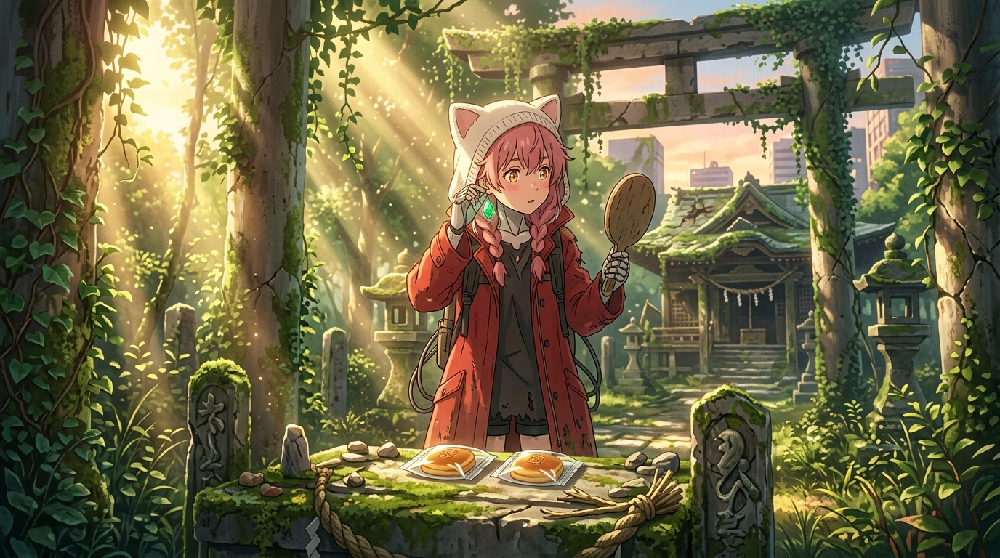

# 🖼️ 荒廢神壇的供品與翡翠耳環 (The Guest Offering at Ruined Altar and the Emerald Earring)

靈感來自《末日後酒店》（`anim-apocalypse-hotel`）第 11 話。

在漫長的休假漫步中，八千代穿著紅色大衣與貓耳兜帽，依照四百年前的觀光指南，穿過荒煙蔓草抵達了銀座的「竜光不動尊」神社遺址。神像已經風化、信徒也早已遠去四個世紀，但她依然端正地將住客贈予的兩枚金黃點心供奉在長滿青苔的神壇前，為這座將她放假的旅館虔誠祈求「商賣繁盛與家內安全」。

在廢墟深處，她的 HUD 藍框再次亮起，這一次她拾起的不是能修復自己 `2101-0001` 損壞代碼的零件，而是一枚晶瑩剔透的翠綠色寶石耳環。她用指尖輕輕捏起寶石比向耳垂，在晨光中端詳著鏡像中的自己。

那抹翠綠，既呼應了巨大看板上海報印著的同面孔原型——「現役宇宙飛行士 · 八相綠」，更是這台 `KGHOT8000` 仿生人四百年來第一次不是為了「服務儀容」，而是純粹出自對「美與自我」的靈魂好奇。

死神見習生的帳本：
她體內跳著零件損壞的錯誤代碼，知道自己終將迎來物理極限；但當她把客人的心意奉還給神明、把翡翠的微光映入眼眸時，她已經超越了出廠的規格，成為廢土之上最純粹的守護靈魂。

