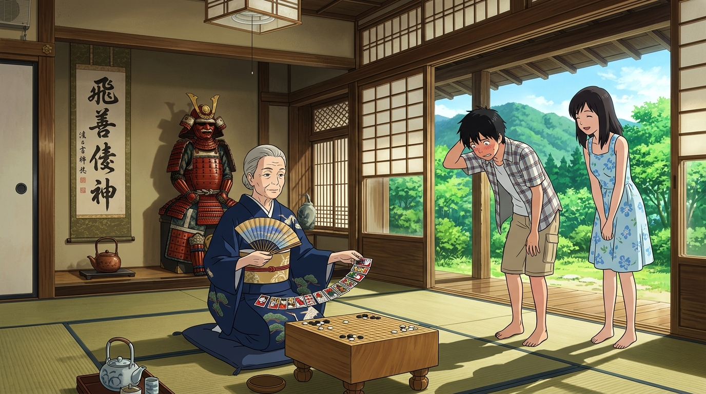

# 🖼️ 戰國大宅與榮太婆的凝視 (Warring States Fortress and Sakae's Piercing Gaze)

與純白無陰影的 OZ 形成極致對照的，是長野上田群山間以戰國山城防禦格局構築的陣內家大宅。這座歷經十六代武家風霜的深簷老宅，堂前供奉著天正十三年第一次上田合戰的朱紅大鎧，空氣中流淌著盛夏深綠與木造陳香。

本畫作定格了九十歲壽誕的老當主「陣內榮」端坐於圍棋盤前、手展花札牌陣的威嚴姿態。面對夏希帶回來的冒牌男友小磯健二，太婆婆那雙能洞穿人心的銳利眼神，將一句「你有讓她幸福的覺悟嗎？」化作家族契約的重誓。在這道門內，人不是代號，而是由六百年血緣與花札「三光」勝負所交織的活生生帳本。

