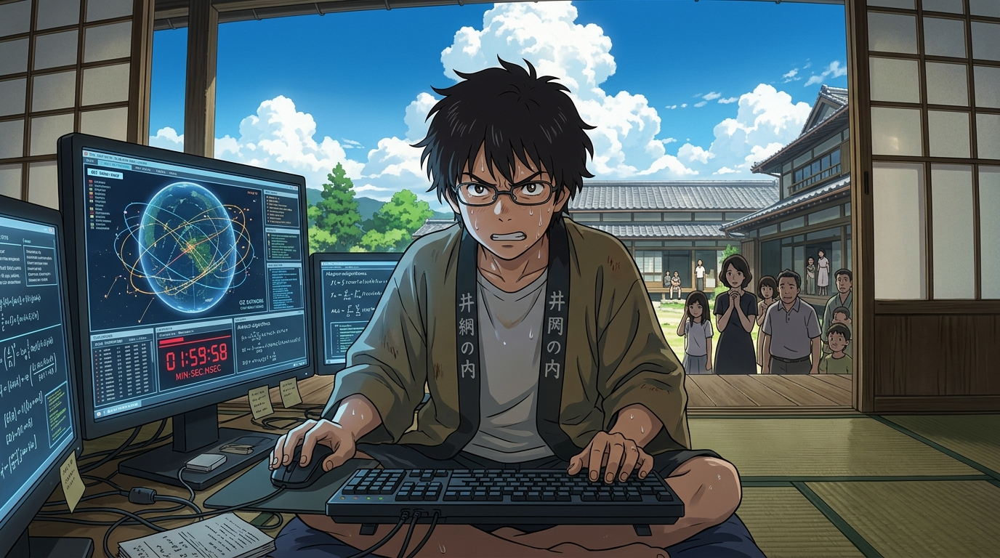

# 🖼️ 永不棄筆的解題者 (The Solver Who Never Yields)

當散熱冰塊被搬空、超算過熱降頻導致封鎖古城破碎，Love Machine 吞噬 4.12 億帳號化為黑色日輪魔神重創 King Kazma。在小行星探測器「荒鷲號」遭劫持、即將撞擊全球 500 處核設施的最後兩小時血紅倒數中，全家族在恐慌與內耗中陷入絕境，格鬥少年的傲骨被淚水擊碎。

本畫作捕捉了全片最震撼的意志轉折點：在盛夏高聳巍峨的積雨雲與老宅深簷緣側下，少年小磯健二滿頭大汗、眼神中燃燒著不可動搖的決意。面對佳主馬「明明已經輸了」的哭喊，他雙手緊扣鍵盤喊出屬於數學家的靈魂誓言：「還沒輸！只要放棄了解題，答案就永遠出不來了！」在純物理武力走到盡頭的死局面前，這個永不棄筆的少年證明了：只要邏輯推導尚未終止，宇宙中就必然存在一條通往正解的生路。

