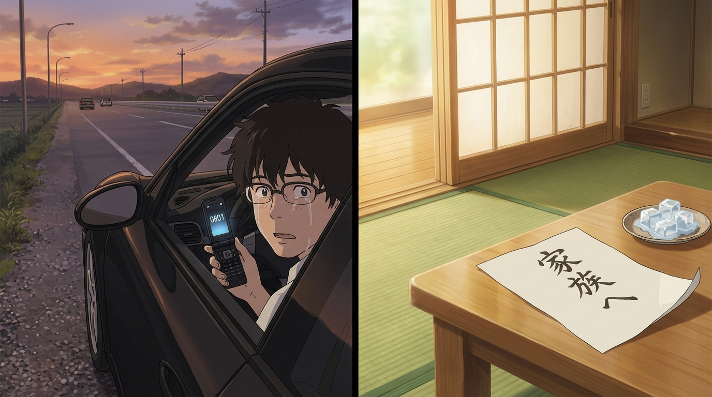

# 🖼️ 密碼 0801 與手寫遺書 (Passcode 0801 and the Handwritten Letter)

在這場席捲全球的數位風暴中，兩組最微小卻最強大的「憑據」跨越了演算法的壁壘。一組是黑客陣內侘助隨身手機的四位數密碼「0801」——那是他宣稱早已遺忘的榮奶奶生日；另一組則是老宅和室榻榻米上，榮奶奶生前親筆留給家人的手寫信紙「家族へ」。

本畫作以並置鏡頭呈現這份跨越生死的深沉情感：左側是黃昏公路旁，侘助在車內看著發光的折疊手機，十年叛逆與傲慢被夏希的一通電話徹底戳穿，在遲來的死訊前崩潰流淚；右側則是夏日微風拂過的安詳和室，融化的冰塊旁靜靜攤開著奶奶的最後囑託：「總之首先要冷靜，葬禮簡辦，之後一如既往地好好生活。」最堅固的密碼不是暴力破解能洞穿的算式，而是至親彼此的理解；最不可摧毀的協議不是雲端數據，而是紙墨上永不熄滅的家族之魂。

