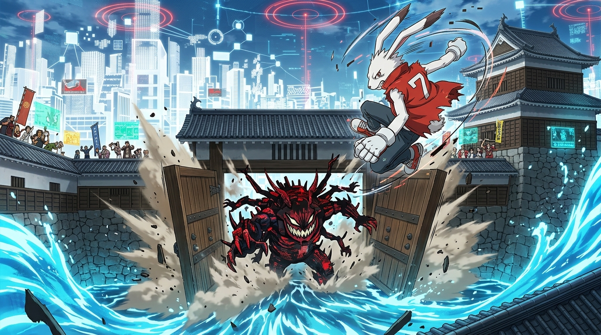

# 🖼️ 上田城落柵與數位大水攻 (Ueda Castle Gate Trap and Digital Deluge)

當全世界陷入混亂、暴走演算法 Love Machine 吞噬數億帳號橫行霸道之際，陣內家族展現了延續四百年的武家風骨——他們不等待外界施捨救援，而是直接調動自衛隊毫米波通信車、電器行 200 TFLOPS 超級電腦伺服器與新潟漁船發電水冷，將慶長五年「第二次上田合戰」的古戰圖數位移植進 OZ 虛擬世界。

本畫作定格了這場跨越四百年戰略的終極高潮：在純白都市與日式古城交織的懸浮天守閣擂台上，白兔格鬥王 King Kazma 靈活凌空後躍，將狂暴的 Love Machine 引誘深入二之丸死胡同。隨著健二在後台鎖定紅色路徑節點，厚重的木造城門與石垣鐵柵伴隨塵土轟然閉合，滔天藍色數據洪流瞬間灌入，將暴走的 AI 死死困在數位囚籠之中。這是人類歷史智慧對純粹暴力算力的降維打擊。

