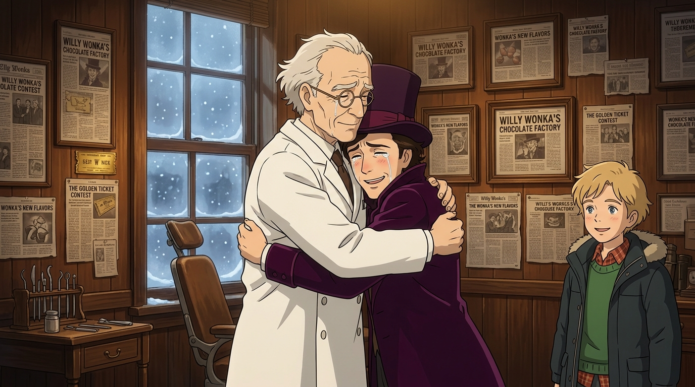

# 🖼️ 滿牆剪報與雙尖牙的救贖相擁 (The Clippings on the Wall and Wilbur Wonka's Tearful Embrace)

在查理的溫柔陪伴下，旺卡終於放下了「巧克力大亨必須孤獨」的虛妄防禦，推開了那間佇立在雪地中、數十年不敢踏入的牙醫診所大門。

屋內昏黃溫暖的燈光下，木質牆壁上整整齊齊掛滿了泛黃的相框與剪報——「旺卡在市中心開糖果店」、「巨型工廠開幕」、「旺卡創造經濟奇蹟」。那位看似冷酷搬走、切斷關係的老牙醫威爾伯·旺卡（Dr. Wilbur Wonka），其實在漫長的歲月裡，默默剪下了兒子走過的每一個里程碑，用滿牆的報導注視著孩子的一生。

當老牙醫拿著口鏡探入旺卡口腔，脫口驚呼「我很多年沒見過這樣的雙尖牙了……自從……威利？」時，父親摘下老花眼鏡熱淚盈眶，顫抖著雙手緊緊抱住了兒子。那道因童年決裂而築起的孤獨高牆，在父親溫熱的胸膛與查理的微笑注視下徹底消融——世上最甜美的味道，終究不是任何奇蹟糖果，而是歷經千帆後重歸懷抱的家庭之愛。

