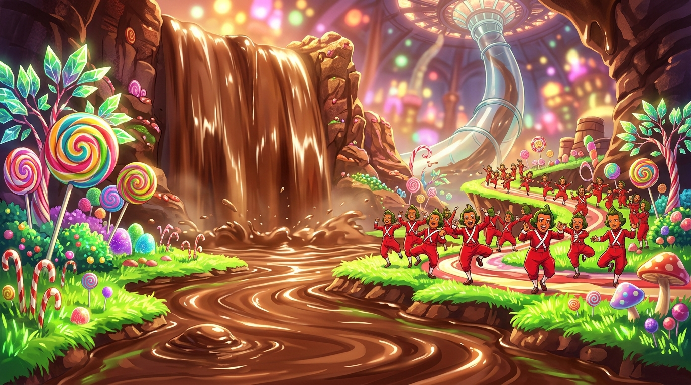

# 🖼️ 巧克力瀑布的審判歌舞 (Fudge Symphony and the Chocolate Cascade)

在濃郁黏稠的巧克力河畔，當失控的暴食者奧古斯都滿臉糊滿糖霜跌入漩渦、被斜插雲霄的巨型透明玻璃吸管無情抽吸之際，整座工廠最震撼也最荒誕的道德處刑正式拉開序幕。

面對溺水呼救的家長，旺卡既未驚慌也未施救，而是將工安意外重新定義為「難得一見的劇場盛況」。對岸糖果山坡上，身穿鮮紅工裝的奧柏倫柏人（Oompa Loompas）迅速列隊，踩著精密劃一的機械舞步與奇詭笑容，唱出早已譜寫完成的指名審判曲《Augustus Gloop》。

歌詞將人體研磨與鍋爐熬煮直白化為「把貪婪肉體煮成人見人愛美味軟糖」的道德奇蹟。在工業流水線眼中，越界的人體不再是純粹的生命，而是有待加工提純的原材料。糖果的極致甜美與處決的冷酷歌舞在此完美交融，構成了旺卡帝國最經典的黑色幽默。

