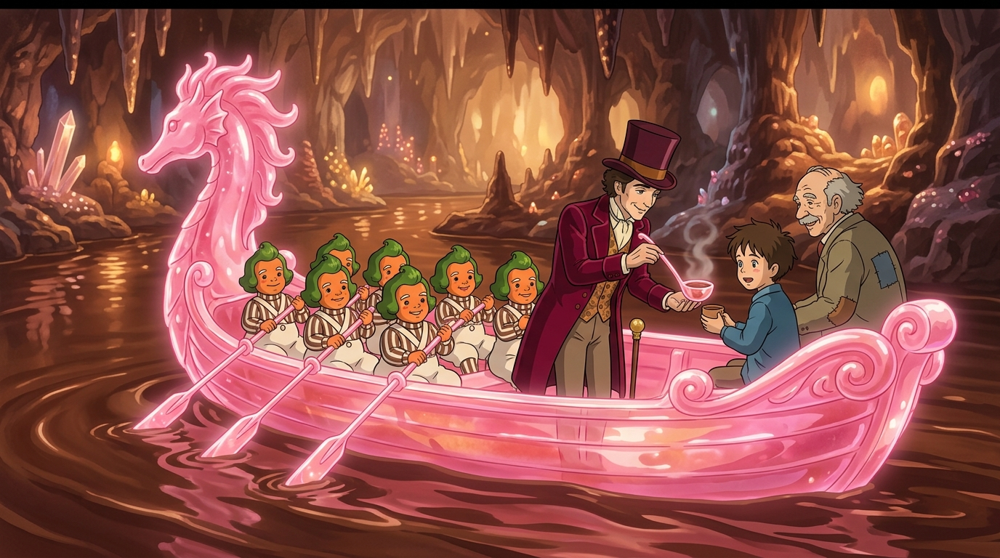

# 🖼️ 粉紅糖舟與唯一溫情 (The Pink Sugar Seahorse and Wonka's Ladle)

伴隨巧克力河的奔流，一艘完全由粉紅透明硬糖一體雕琢而成的海馬龍舟破浪而來。雙列奧柏倫柏划手整齊划動晶瑩剔透的糖雕船槳，在神秘幽邃的地下水道中泛起溫潤甘甜的琥珀波光。

在這座以嚴密防備、冷嘲熱諷與道德篩選為底色的封閉王國裡，旺卡對每一位富家子弟的貪婪與傲慢冷眼旁觀，卻在踏上糖舟的片刻，輕輕舀起一長柄糖勺溫熱的液態巧克力，親手遞給瘦弱的查理：「喝點吧，這對你有好處，你看起來都要餓死了。」

查理眼中閃爍著純真與感激的光芒，而身旁的喬爺爺也露出溫暖的欣慰微笑。這一瓢被瀑布充分攪拌的濃郁甜漿，不僅滋潤了久經匱乏的孩子，也短暫融化了旺卡築起的高傲防線——在無盡的發明狂想與機關算計深處，依然保留著一份對純潔心靈最原始的呵護。

