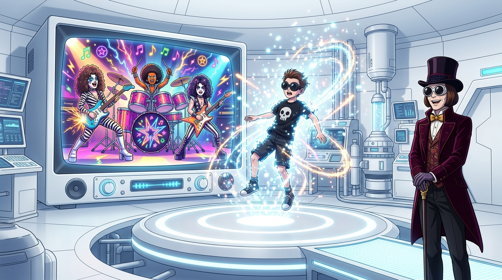

# 🖼️ 量子傳送與電視搖滾狂想 (Television Quantum Dematerialization and Glam Rock)

在宛如太空無菌室的純白電視巧克力間裡，當電視兒童邁克·提維（Mike Teavee）帶著對科學機制的傲慢踩過控制台、躍入發光的圓形傳送台時，白光一閃，整個人原地粉碎成數百萬顆量子微粒，被射入了電視映像管之中。

伴隨而來的不是常規的救援，而是一場跨越電視史的 MTV 狂歡大秀。奧柏倫柏人（Oompa Loompas）戴上蓬鬆爆炸長假髮、穿上斑馬紋皮褲，化身 70 年代華麗金屬搖滾樂團，在電視頻道中飆奏電吉他與雙大鼓，唱出指名處決曲《Mike Teavee》。

歌詞如刀鋒般刺向冷酷的媒介本質——「它腐蝕理智、阻礙思想，把思考力生鏽凍結，無法思考只能呆看（He cannot think, he only sees!）」。邁克精通傳送器的物理公式，卻失去了理解童話與仙境的靈魂能力，最終成了自己所崇拜的電視螢幕中微不足道的一道訊號。

