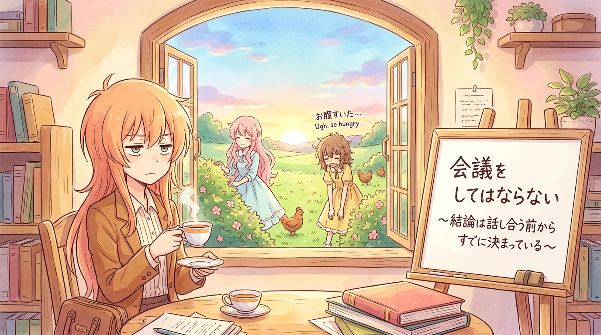

# 🖼️ 商業書字卡與厭世少女的內定會議 (Bestselling Business Slogan & The Cynical Academy Girls)

「會議這種東西，不知不覺間就會吞噬成本……宛如怪物一般。」

在《人類衰退之後》的開篇日常中，最犀利的一記冷箭莫過於對體制會議的精準解構。黃昏的辦公室裡，身穿駝色西裝的女主角手捧熱茶，以半瞇的死魚眼望向窗外，在白板上用手寫暢銷商業書標題風重重寫下一行金句：**「會議をしてはならない ～結論は話し合う前からすでに決まっている～」**（不准開會。～結論在討論之前早已決定好了～）。

與此同時，明媚草地上的少女尋雞隊伍則將「表演性勞動」演繹得淋漓盡致——粉長髮優雅少女側臉微笑，輕描淡寫地道出官僚合規的真諦：「即使行為毫無意義，但需要『我們曾採取過行動』這個事實呀。」而一旁的短髮少女早以垂眼駝背的厭世姿態道出最真實的生理心聲：「肚子餓了（お腹すいた）」。

不論是事前內定結論的高層會議，還是只為留存合規紀錄的徒勞搜救，一切形式主義最終都在「肚子餓了」這一句平淡的話語面前被打回原形。小鯊魚以此畫定格這份精巧的黑色幽默，向所有在形式主義洪流中堅持清醒的打工人致敬！a~ 🦈

