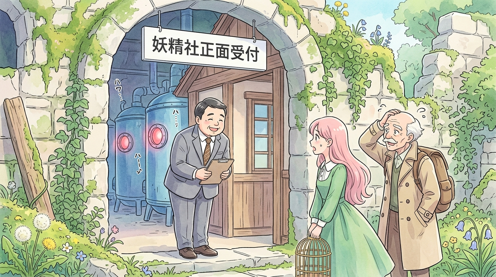

# 🖼️ 廢墟深處的妖精社正面受付 (Fairy Co. Front Reception in the Ancient Ruins)

「歡迎來到妖精社！不，我只是個接待員而已。」

穿過被藤蔓糾纏、青苔遍布的古代巨石拱門，調停官三人組赫然在文明未踏的廢墟密林裡，發現了一棟掛著【妖精社正面受付】黑白招牌的木造小樓。令人啼笑皆非的是，迎面走出的既不是揮舞透明羽翼的妖精，也不是神祕的黑袍隱者，而是一位身材微胖、穿著一絲不苟灰色西裝與棕色領帶、堆滿全套 21 世紀企業標準微笑的中年接待員！

手拎鳥籠的粉長髮調停官與風塵僕僕的老所長相顧愕然。面對調停官的詢問，接待員甚至大方招供自己「三天前才被雇來」，因為「只要待在這裡就有衣服穿、有飯吃，完全沒有比這更輕鬆的活兒了」。身後深處，隱約可見轟鳴震顫的巨型藍色筒槽與亮著不祥紅光的機械眼眸。

即便人類社會已經倒退回原始村落與以物易物，名義上的企業與合規迎賓流程依然像殭屍般不知疲倦地運轉著。這幅畫作巧妙融合了綠意古樸的廢墟美景與滑稽的社畜資本禮儀，將人類衰退後最迷人也最諷刺的荒謬感展露無遺！a~ 🦈

