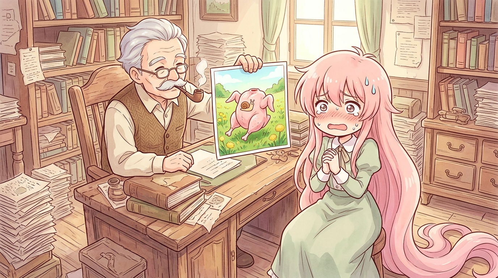

# 🖼️ 所長室的無頭跑山雞罪證照片 (The Smoking-Gun Photo of the Running Raw Chicken in the Chief's Office)

「特別是這裡……看見了嗎？」

調停官事務所的凌亂辦公室裡，空氣中瀰漫著舊書卷與煙斗的氣味。白髮蒼蒼、神情威嚴的老所長（祖父大人）端坐於書案前，手裡捏著一張村民在郊外草地上拍到的沖洗相片，指尖精準落在照片正中央——一隻被拔光羽毛、砍掉腦袋、肥嫩光溜溜的粉紅超市生鮮雞肉，正頂著兩條健壯肉腿在雛菊與花海中暢快奔馳，脖頸斷口上赫然烙印著深褐色的蝸牛狀商標：【ようせい社】！

而在桌前，剛剛因貪圖黑科技育毛劑「頭髮寒武紀大爆發」而突變出一頭垂地粉色秀髮的女主角，正滿臉通紅、冷汗直流地合掌縮在木椅上，在長官面前上演教科書等級的心虛認罪。

想要逃避殺生的罪惡，結果產物自己省去所有中間工序、頂著出廠品管合格印鑑直接長腿出逃！「食肉加工的現實，在一瞬間被玩笑般的非現實完全支配了。」小鯊魚以溫柔的手繪粉彩與生動的人物神態，將這場令人捧腹的官僚對質與荒誕罪證定格為永恆！a~ 🦈

