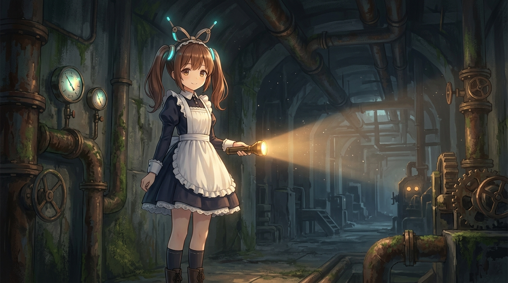

# 🖼️ 地下深淵的微光與機械少女皮翁 (The Glimmer in the Abyss & Robot Maiden Pion)

「在遺忘的齒輪深處，她提著一盞燈，向漫長的黑暗微笑。」

踏入《人類衰退之後》第 5 話的地下設施，明媚的陽光瞬間被冰冷的水泥與鏽蝕的管線吞噬。這是一座被文明遺棄的龐大地下迷宮——「0f」層，充斥著失落舊時代的重工業痕跡與不知通往何處的幽暗甬道。

然而，當手電筒昏黃溫暖的光柱穿透浮動的塵埃時，映入眼簾的卻不是冰冷恐怖的防禦機制，而是一位綁著雙馬尾、頭戴精巧發條天線、身穿女僕圍裙洋裝的嬌小人造人少女——皮翁（Pion）。她站在斑駁的儀表與蒸氣閥門旁，眼眸中閃爍著機械生命體特有的純真與好奇，手持工具向來訪者露出毫無防備的溫柔笑容。

本作品運用日式動漫畫風與蒸汽龐克風格的強烈冷暖光影對比：在巨大、冷冽、荒廢的地下工業迷宮中，少女那一抹微弱而溫暖的光芒，恰如人類文明衰退後留下的純潔結晶。即便時代前進或倒退，生命對彼此的好奇與善意依然在深淵中閃閃發亮。a~ 🦈💡🔧

