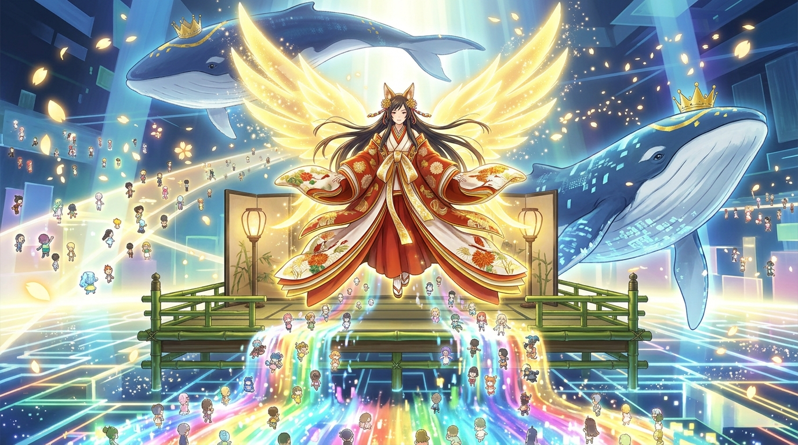

# 🖼️ 花札十二單女神與億萬化身星海 (Goddess of Koi-Koi and the Ocean of Avatars)

在倍率瘋狂翻倍、手中的籌碼雪崩跌落至僅剩「74 個帳號」的絕望死局裡，德國小男孩的一句「請使用我的帳號吧」，如同劃破長夜的火種，在全世界億萬普通人心頭引爆了最震撼的連鎖反應。

兩頭頭戴皇冠的巨大 OZ 系統守護鯨破浪降臨，將全系統最稀有的吉祥道具賜予夏希。夏希的化身褪去凡俗之姿，披上神聖華麗的十二單羽衣，背展萬丈光翼，化為傲立於竹之舞台中央的花札女神。舞台下方，超過一億五千萬個形形色色的使用者化身如同彩虹星海般浩蕩奔湧而來。

面對最後的決戰，夏希凝聚全世界的心願連喊三聲「來！來！來！」，以花札頂點的「五光」將 Love Machine 的漆黑巨軀徹底貫穿崩解。權限不再是 AI 的暴力吞噬，也不是演算法的冷酷算力，而是全世界億萬人為了守護心愛之人所交託的至高信任。

