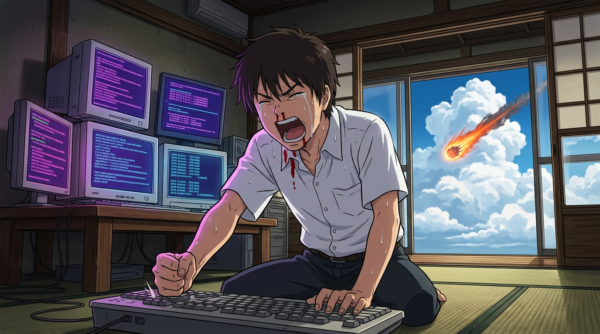

# 🖼️ 榻榻米上的死線心算與拜託了 (Dead-Line Mental Math and Yoroshiku Onegaishimasu)

花札的大勝奪回了數億帳號，全世界的世界時鐘皆已停滯，然而螢幕上荒鷲號探測機的 GPS 墜落倒數卻依然瘋狂跳動——目標經緯度直指長野上田陣內大宅。

「外觀 OK 不等於真的 OK。」在密碼被 AI 臨死竄改、榻榻米上的鉛筆筆尖應聲折斷的最後兩分鐘，健二放棄了一切外在依賴，直接閉眼闖入了最純粹的純心算領域。螢幕上傾瀉著如瀑布般紫紅相間的 2056 位天文級解密數列，汗水與鼻血滴落在紙頁上，雙手在鍵盤上殘影盲打。

在倒數歸零的最後零點幾秒，健二用盡全身靈魂與淚水，重重砸下 Enter 鍵，吼出那句震撼人心的傳世名台詞：「よろしくお願いしまぁぁぁすっ！（拜託了！）」偽造的 GPS 原子鐘補正訊號瞬間生效，下墜的流星擦過屋頂偏轉砸入後山。解題者的執著與神經元的火花，在死線前完成了對物理世界的終極守護。

