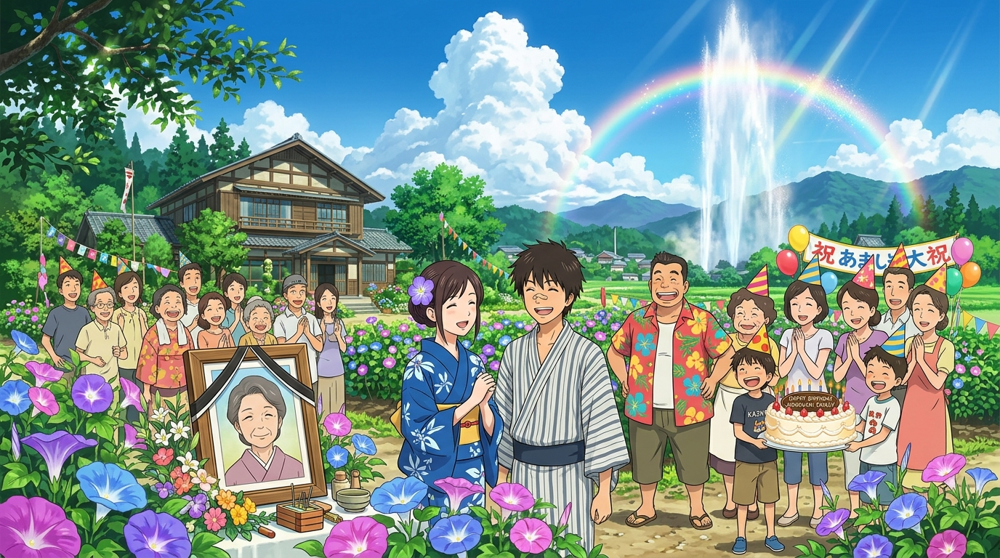

# 🖼️ 牽牛花下的全家福與溫泉彩虹 (The Family Song under Morning Glories and the Hot Spring Rainbow)

當荒鷲號探測機的衝擊波消散，大宅後山原本被砸開的荒涼廢墟深處，竟然奇蹟般噴湧出直插雲霄的白熱天然溫泉水柱，在燦爛的夏日晴空下折射出絢麗奪目的七色彩虹。

陣內家沒有沈溺於劫後餘生的哀傷，而是徹底貫徹了榮奶奶遺書中「絕不能孤單、一如既往好好生活」的囑託。前院青翠的草坪上，榮太婆慈祥開朗的遺照被院子裡繁茂盛開的紫藍牽牛花溫柔簇擁；侘助換上花襯衫回歸家庭，夏希眼含秋波與微笑望著滿臉傷痕卻無比靦腆的健二。

全家老少戴著派對尖帽、捧著生日蛋糕，在夏日微風與山下達郎悠揚的歌聲中，齊聲唱起「祝你生日快樂，親愛的奶奶」。高科技的 OZ 虛擬狂潮已然平息，而深植於這片土地上的家族飯桌、手牽手的溫度，以及永不熄滅的愛與信賴，才是守護這個世界最堅不可摧的地基。

