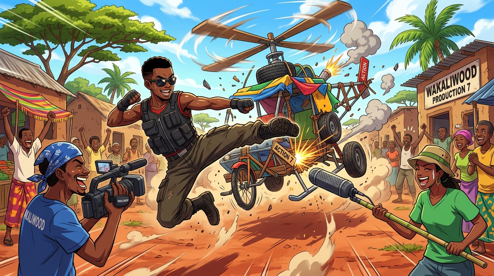

# 🖼️ 廢鐵直升機與 200 美元的動作狂潮 (Wakaliwood DIY Action: The 200-Dollar Blockbuster Dream)

> 「在我們這兒，不管什麼都是道具！沒有好萊塢的預算，那就用熱血與真功夫把銀幕砸穿！」

走進烏干達貧民窟的烈日紅土，瓦卡里伍德（Wakaliwood）用兩百美元向全世界示範了什麼叫做「最純粹的電影靈魂」。在這裡，沒有百萬美元的綠幕攝影棚，廢棄汽車零件與爛鐵條焊成了武裝戰機，竹竿綁著海綿就是專業收音桿，木頭削成的螺旋槳在孩子們的推動下呼呼狂轉，炸裂出一團團自製的搞笑煙火與火花！

鏡頭前，身穿戰術背心與墨鏡的黑人武術家騰空躍起，一記勢大力沉的飛踢直接踢碎一切「不可能」；鏡頭後，扛著手持攝影機的青年笑得滿臉燦爛，全村老小都在紅土路旁振臂歡呼。正如同事所觀察的：在這裡，「道具」與「生活用品」不分是他們的製作方法，也是他們面對生活的韌性。

粗糙的五毛錢特效擋不住滿溢而出的快樂與真誠。不需要等待完美的條件才能出發，只要心裡有故事、眼裡有火光，破銅爛鐵也能飛上藍天，成為燃燒整片大陸的超級大片！a~ 🦈🎬💥🔥

