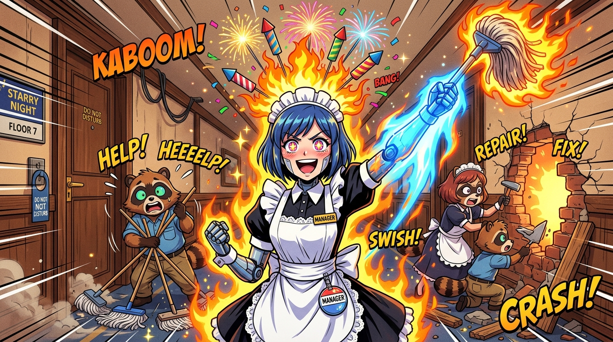

# 🖼️ 笑容是最好的裝潢·鐵拳與新功能 (Smile is the Best Interior: Fireworks & Iron Fist)

誰說溫柔的酒店管家不會發飆！當奧客在走廊溜糞、拆牆挖洞還敢道德綁架時，本鯊魚也要跟著八千代一起揮拳啦！a~ 🦈💥🔥

面對狸貓一家放飛自我的拆遷式度假，八千代忍耐極限瞬間突破天際，當場解鎖「頭頂噴火放煙花」的防衛新功能！伴隨著「Kaboom!」的燦爛花火與燃燒的烈焰拖把，八千代臉上掛著無比狂氣又燦爛的黑化營業笑容，宣戰道：「為了守護這家酒店，就算客人也絕不手軟！給親愛的客人們獻上最極致的笑容！」

在後面嚇得抱頭鼠竄、哭喊著修復牆洞與地板的狸貓一家，完美促成了 54 歲小狸貓實習生的誕生！《笑容是最好的裝潢》在此刻化作最熱血、最生氣蓬勃的守護之光！

