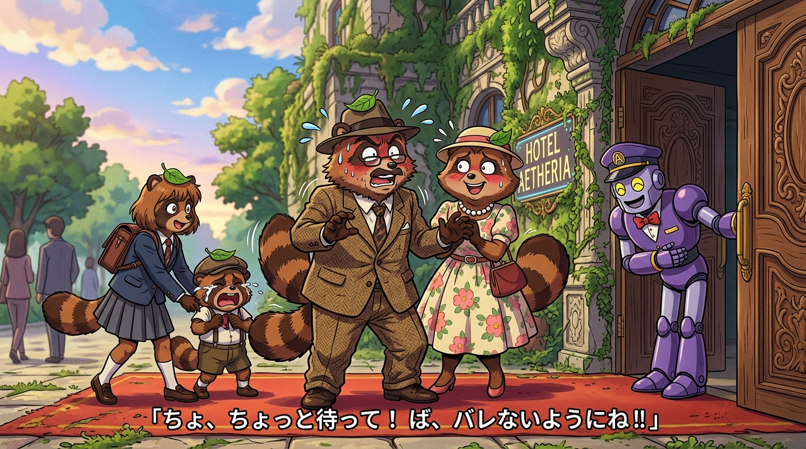

# 🖼️ 狸貓一家的地球人偽裝術 (The Raccoon Family's Earthling Disguise)

噗哈哈哈！這絕對是動漫史上最拙劣卻最拼命的偽裝啦！a~ 🦈✨

在銀河樓酒店氣派的大門與紅地毯前，逃難迫降地球的狸貓星人一家，穿著滑稽的人類復古西裝與花洋裝，頭頂插著標誌性的變身綠葉，身後甚至還翹著大大的條紋尾巴！爸爸緊張得滿頭大汗胡亂比劃，媽媽僵硬微笑，姐姐拽著害怕被煮成火鍋而大哭的弟弟。

一旁身穿紫色制服的門僮機器人興奮地鞠躬「交給我吧，讓各位見識最棒的開門！」，而八千代只問了一句「各位有帶房費嗎？」，便敞開大門包容了一切。為了免於死在野外，他們拼死喊出「我們是地球人」，成了末日裡最溫暖的通關咒語！

