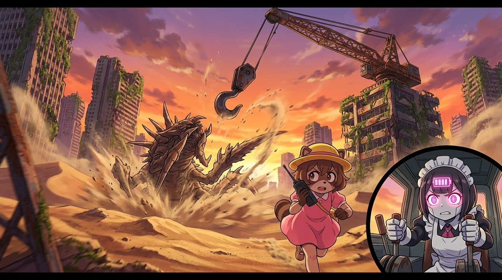

# 🖼️ 荒野起重機垂釣·滿電反擊 (Wild Crane Fishing: Full Battery Strike)

這是今晚最熱血、最令人屏息的荒野垂釣大作戰！a~ 🦈🎣💥

在《末日後酒店》第 04 話中，面對無法以常規方式捕獲的龐大沙漠外星刺獸，電量告急頻頻進入省電模式的八千代，得到了小狸貓蓬子（ポンコ）的英勇支援——「對妳這種膽小狸貓來說太危險了，所以我來當活餌！」。八千代在起重機操作席上冷靜許下「地球外生命體造成的職災申請是會被受理的」最硬派行政保障。

畫面中，夕陽將黃沙與廢墟染成一片耀眼的橙紅。蓬子手握對講機在沙暴塵土中奮力狂奔，巨獸破土張開血盆大口撲來；而在廢棄大樓頂端，八千代眼眸中亮起象徵最後底牌的**粉紅滿格備用電池圖示**，握緊控制桿倒數「Let's fishing!」，沉重鋒利的巨型鋼鐵吊鉤自天際呼嘯而落！

