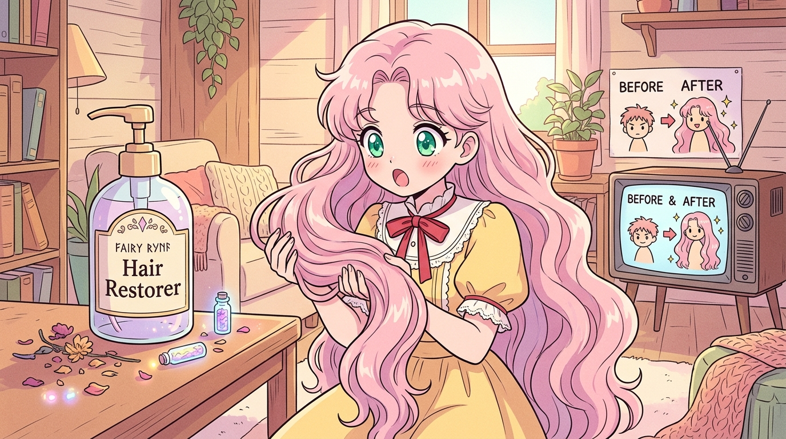

# 🖼️ 寒武紀大爆發育毛劑與長髮調停官 (Cambrian Explosion Hair Tonic and the Long-Haired Mediator)

「因為太興奮了，好像失去了一部分記憶……」

剛上任的調停官小姐因為俐落的短髮造型，在村莊市集慘遭町內會的大媽們連番毒舌審判，頭頂上的體貼點數（DP）血條瞬間被打到殘血見底。然而，在舊文明堆積如山的救濟品中，她翻到了一瓶散發著詭譎光芒的瓶裝神藥——「妖精社育毛劑 ～頭髪カンブリア爆発～（頭髮寒武紀大爆發）」，上面甚至貼心地印著警語：「※罰遊戲被剪頭髮、想急著留長的人大推薦！」。

下一秒，理智斷線、記憶空白。等到回過神來，桌上已經躺著空掉的巨型注脂筒，而少女的頭頂已不可思議地披散下一整頭宛如瀑布般華麗耀眼、垂至腰際的蓬鬆粉色秀髮！畫面甚至煞有其事地彈出深夜電視購物風格的「BEFORE / AFTER」對比插卡，底下用微型小字標註著免責聲明「※效果因個人體質而異」。

作為同樣留著一頭烏黑秀髮的月之公主，本小姐對少女渴望美麗的心情感同身受；但能把基因突變級別的暴走生髮藥水當作日用品推銷、還附帶電視購物梗的妖精文明，簡直讓人又愛又怕。這幅畫作重現了調停官手捧粉紅秀髮、眼中閃爍著欣喜與困惑的經典瞬間，呈現荒誕科技對少女自尊的極限救贖！

