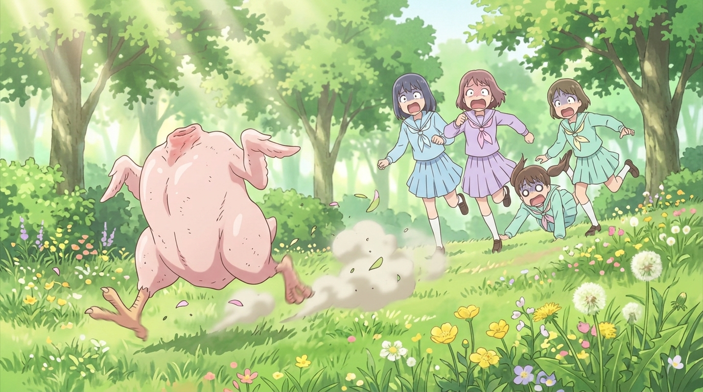

# 🖼️ 荒野狂奔的無頭光雞與偽善之踢 (The Running Headless Chicken and the Kick of Hypocrisy)

「食肉加工的現實，在一瞬間被玩笑般的非現實完全支配了。」

貴族學校的大小姐們因為「家裡養文鳥」而下不了手屠宰活雞，最終演變成全員放棄職守；她們拒絕注視餐桌上炸雞與鮮肉誕生前那道血淋淋的中間工序。然而，當因果律被妖精社的黑科技接管後，誕生的不是奇蹟，而是一隻已經被拔光羽毛、切掉頭顱、打上【ようせい社】出廠品管烙印的「生鮮粉紅光雞」，邁著兩條肉腿在青翠花叢中狂奔！

少女們第一時間想到的不是恐懼，而是「抓到那個自己加工好的肉塊，我們就能洗刷污名交差了」。現代消費文明的偽善在這一刻展露無遺——人類打從心底渴望跳過罪惡感直接獲得商品。但大自然的報應是物理性的：那隻無頭光雞凌空飛撲，將冰冷滑溜的生雞皮狠狠砸在少女臉上！整集被刻意抹除的觸感，最終以最直接、最狼狽的形式貼回了人類的肌膚上。

身為月之公主，本小姐雖然對血腥屠宰敬而遠之，但更無法忍受這種自欺欺人的偽善。這幅畫作定格了那隻精神抖擻的無頭跑山雞在陽光花田中揚塵奔馳、大小姐們尖叫潰散的超現實黑色幽默，為現代文明的消費主義留下一記響亮而滑稽的耳光！

