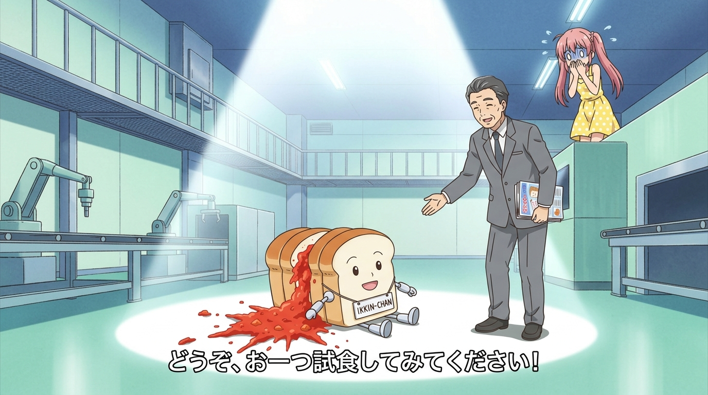

# 🖼️ 聚光燈下的切腹吐司一斤先生 (Mr. Ikkin The Suicidal Bread Under the Spotlight)

「請用吧。」——「不需要。」

走進深山廢墟裡的「妖精社工廠」，迎接調停官一行人的不是溫馨的童話工坊，而是一座轟鳴運轉卻空無一人的全自動冰冷現代廠房。三天前才被雇來當門面的西裝接待員一臉爽朗地坦白：「其實我也是第一次進廠呢！」，並隆重介紹接下來將由專門的「麵包機器人」進行解說。

然而，當全場燈光驟暗、一束無比神聖的白色舞台聚光燈從穹頂直直落下時，出現在光圈中央的，居然是一顆白白胖胖、長著機械小短手、胸前掛著名牌的吐司麵包「一斤先生（一斤さん）」！在熱情喊出「歡迎光臨」後，一斤先生的頭部突然毫無預警地轟然爆裂，像極了 B 級恐怖片切腹般噴湧出滿地的鮮紅胡蘿蔔果汁！而在血泊中抽搐的麵包，依然掛著甜美的職業微笑吐出最後遺言：「推薦給、不敢吃胡蘿蔔的幼童喔……」

西裝主管滿面春風地伸手勸吃，調停官小姐嚇得魂飛魄散斷然拒絕。這正是全劇最震撼、最掉 SAN 值的超現實高潮——當商品的生產被徹底自動化，消費主義的極限便是讓「商品自己流盡最後一滴血來推銷自己」。這幅畫作以強烈對比的光影，將這場兼具邪典、諷刺與荒謬的現代寓言永遠定格！

