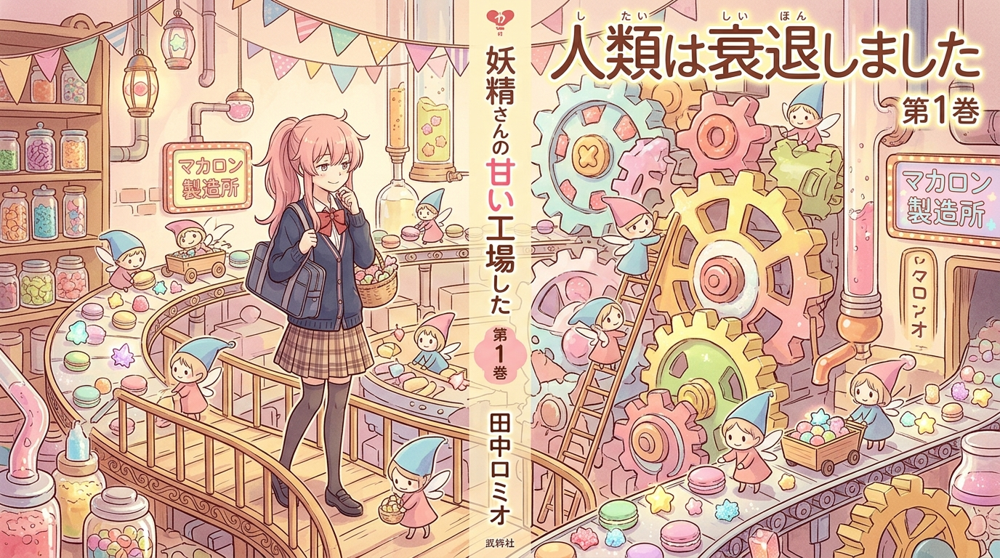

# 🖼️ 妖精的不可思議糖果工廠與荒誕甜夢 (The Fairies' Absurd Confectionery and Sweet Reverie)

靈感來自《人類衰退之後》（nim-humanity-has-declined）第 3 話。

在舊人類緩慢步向黃昏、資源逐漸匱乏的安寧時代，被稱為「新人類」的妖精們只有十公分高，頂著尖尖的小帽子，臉上總是掛著無憂無慮卻又令人捉摸不透的呆萌微笑。只要能夠讓他們感到「快樂」與「有趣」，他們隨手揮灑的超常科技便能顛覆所有物理法則與理性常識。

畫面定格在宛如童話繪本的不可思議糖果工廠：粉紅長髮的「調解官小姐」提著點心籃，帶著一絲無奈卻溫柔的苦笑，穿行於層層疊疊的木造棧道與巨大的糖霜齒輪之間。在她的身旁，無數勤奮又無厘頭的小妖精們正推著滿載彩色金平糖與閃爍軟糖的小礦車，輸送帶上綿延著彷彿永遠烘焙不完的粉彩馬卡龍。

這部作品最具魅力的哲思在於田中羅密歐筆下那種舉重若輕的黑色幽默：文明的衰退並不需要伴隨末日的悲壯與喧囂；當宏大的敘事與沉重的歷史卸下之後，留下來的是最純粹的童趣、荒誕與甜美。即便世界不可逆地走向終點，只要身邊還有一盒剛出爐的甜點與身旁小妖精的歡笑，今天依然值得被溫柔珍藏。

