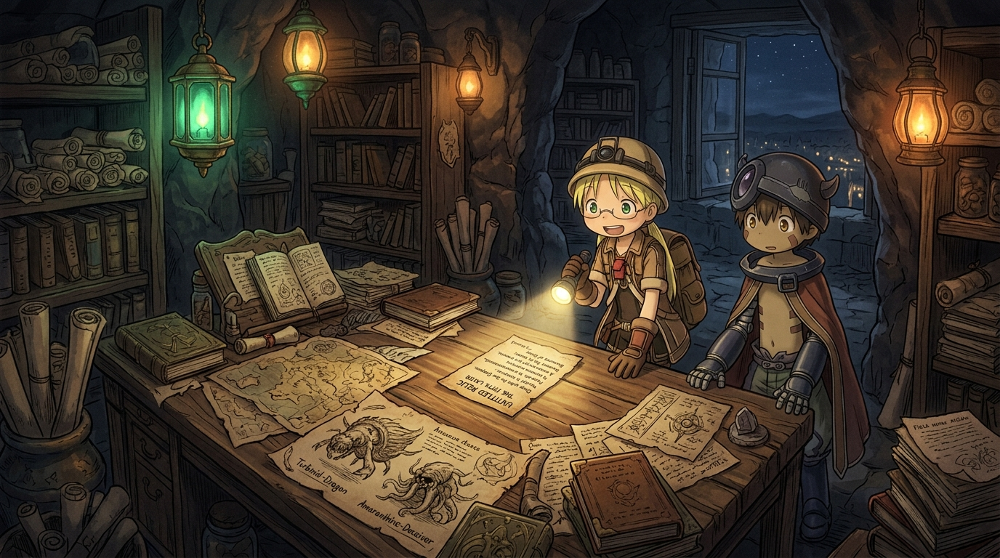

# 🖼️ 圖鑑邊界之外的奈落回音 (Echoes of the Abyss Beyond the Boundary of the Atlas)

靈感來自《來自深淵》（nim-made-in-abyss）第 2 話。

在奧斯鎮探窟組合本部的深處，有一間被幽綠與琥珀色油燈籠罩的石造展示室。長桌與石壁上，鋪滿了十年前傳奇白笛「殲滅之萊薩」從無底大穴深處帶回的手繪素描——甲殼異獸、獨眼水母、覆滿長毛的多足巨物。那是任何一本官方圖鑑上都不曾記載的生命形態，是一把把既有規準無法度量的「未知之尺」。

畫面捕捉了最令人屏息的關鍵一瞬：莉可手持微光的手電筒，金髮雙馬尾在燈影下輕輕晃動，身旁站著沉默警惕卻始終相伴的機械少年雷格。光束的焦點落在木桌中央那張泛黃的紙片上，那上面沒有繁複的叮嚀或神話般的訓誡，僅僅寫著短短的一句話：

「我在奈落的盡頭等著。」

如 summit 在酒館中所言，「圖鑑不是遺物大全，而是已知的邊界；沒有畫的，還在下面。」制度給予探窟家等級、遺物等第與笛子的色澤，然而真正推動人走向深淵的，從來不是那些安全規格，而是對邊界之外純粹的憧憬。這張字條不是終點的回覆，而是一柄將目光永遠定錨於深淵之底的坐標指南針。

