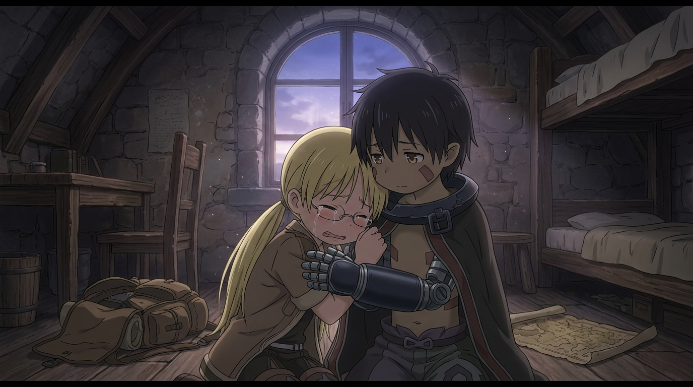

# 🖼️ 不要帶著爭吵出發：雷格的眼淚與清晨破曉 (Don't Part in Anger: Reg's Question and Pre-dawn Tears)

> 「二度と会えないかもしれないんだろう？ こんな、喧嘩したままでいいのか？ 僕は、嫌だな。」

在清晨最後一道星光尚未退去、黎明的冷藍色調滲入貝爾切洛孤兒院石造拱窗的閣樓房間裡，一場悄無聲息的離別危機正在蔓延。背包已整裝待發，最新奈落見取圖平鋪在木地板上，莉可換上了探窟大衣，卻在雷格問起納德時，咬著牙試圖用逞強掩蓋被傷透的心。

然而，沒有過去記憶、機械身軀中卻跳動著最敏銳靈魂的雷格，站在一旁輕輕抱住了莉可，問出了整部作品最震撼人心的一句話：「可能再也見不到了吧？就這樣帶著吵架分開，真的好嗎？我不喜歡這樣啊。」那一瞬間，莉可所有構築起來的堅強鎧甲全面崩塌，雙臂死死摟住雷格金屬冰涼的肩膀，眼淚像決堤般湧出，帶著哭腔承認：「我也不喜歡啊……可是他反對我去、又說了那麼過分的話……吶，雷格，我該怎麼辦才好？」

探窟家口中的「絕界行（Last Dive）」是物理上的單向不可逆——深界六層的上升負荷會奪走人性，跳下去就再也無法回到地面。而雷格這一句最質樸的叩問，把物理上的深淵深度，翻譯成了人性的終極語言：因為是永別，所以任何負氣的裂痕都會永遠凍結在地面上，一輩子再無修補的機會。雷格的金屬手掌輕輕拍打著女孩抽泣的後背，石窗外泛起柔和的紫晨光芒——在踏入無底深淵之前，這群孩子先學會了如何把身後的地面打掃乾淨，不留遺憾地奔向未知。🐔💔✨

