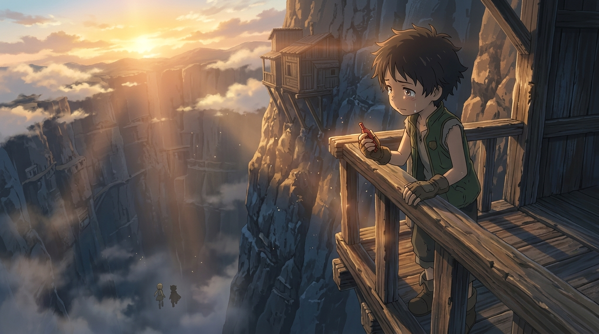

# 🖼️ 深淵之緣的守護者：納德的月笛孤兒院夢 (Guardian on the Abyss Edge: Nat's Moon Whistle Dream)

> 「ここのガキはみんなあの奈落門見ちゃ、探窟家に憧れて……そうじゃなきゃ、みんなゴミの毒で病気になるか、死んじまうかだ。俺、リーダーみたいに月笛になったら、ここに孤児院作りたくてさ。」

在《來自深淵》第 3 話〈出發〉的片尾名單悄然滾動之際，全劇最深沉、最讓人眼眶泛紅的獨白，完完全全屬於出身貧民窟岩壁街的少年納德。晨光穿透深淵上方翻湧的雲海，微弱的晨曦照亮了懸掛在千仞絕壁上的破舊木屋。納德手裡握著學徒笛子，雙手緊扣在風化的欄杆上，淚水奪眶而出，凝視著薄霧深處莉可與雷格逐漸隱沒的小小身影。

白天在孤兒院大吵一架、甚至說出「妳媽早就死了」這種殘酷狠話的他，卻在深夜成為避開奈落門守衛、親自帶領莉可穿過盜掘者小鎮的引路人。這不是自相矛盾，而是他靈魂深處「重力方向」的投射：莉可的渴望是垂直的——她追逐白笛、追逐深淵之底，哪怕粉身碎骨也要下墜；而納德的重力是橫向的——他曾是垃圾堆毒素與死亡陰影下的倖存者，深知「活著」是一場艱辛的奇蹟。他不想成為征服深淵的白笛，他的夢想是成為吉路首領那樣的「月笛」，回到這片泥濘的懸崖上，親手建立一所孤兒院，接住下一個瀕死的孩子。

因為珍惜活著，所以痛恨送死；因為深愛同伴，所以在放手時把所有的祝福化為最堅定的人間錨點。這幅作品捕捉了深淵最殘酷也最溫柔的對稱：有人注定要跳向深淵的黑暗，而有人選擇留在大地之緣，成為守望歸途的微光。🐔✨

