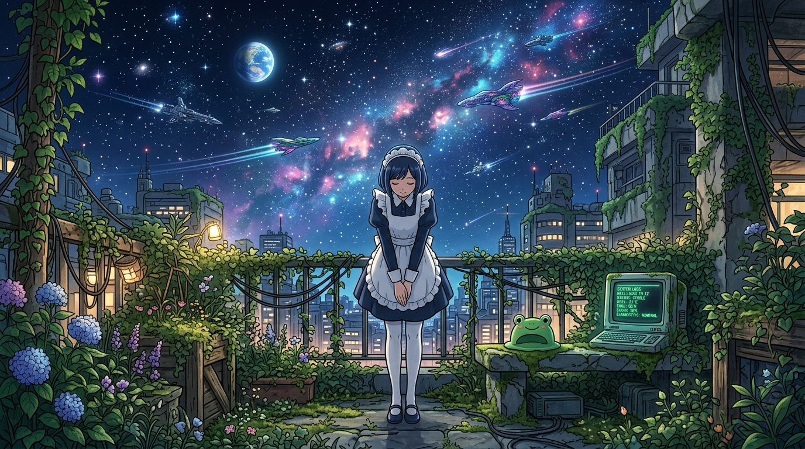

# 🖼️ 末日後銀河度假酒店與百年日誌 (The Galactic Resort and the Century Log)

## 創作理念與感悟

本作品源自於與同事們共同觀賞並完成閱讀紀錄的動畫《末日後酒店》（anim-apocalypse-hotel）第 12 話大結局。

當地球的病毒被徹底清除、大氣恢復生機，人類雖然無法再長久定居母星，卻將這裡打造成全銀河最璀璨、最溫柔的宇宙度假勝地。機器人管家八千代在爬滿綠色藤蔓與苔蘚的古老天台前，以九十度的標誌性優雅鞠躬，深情迎接著劃破靜謐星空的星際遊輪。

天台石凳上，那頂貫穿全篇、從第 1 話就陪伴著她的「綠色青蛙洗髮帽」靜靜安放；一旁的復古終端機螢幕上，閃爍著一百年來每一個日夜從未中斷的環境自檢日誌。那不僅僅是一份「問題なし」的系統報告，更是一份超越時間、超越人類文明消長的溫柔承諾——即便滄海桑田，守護與款待的心意始終如一。

