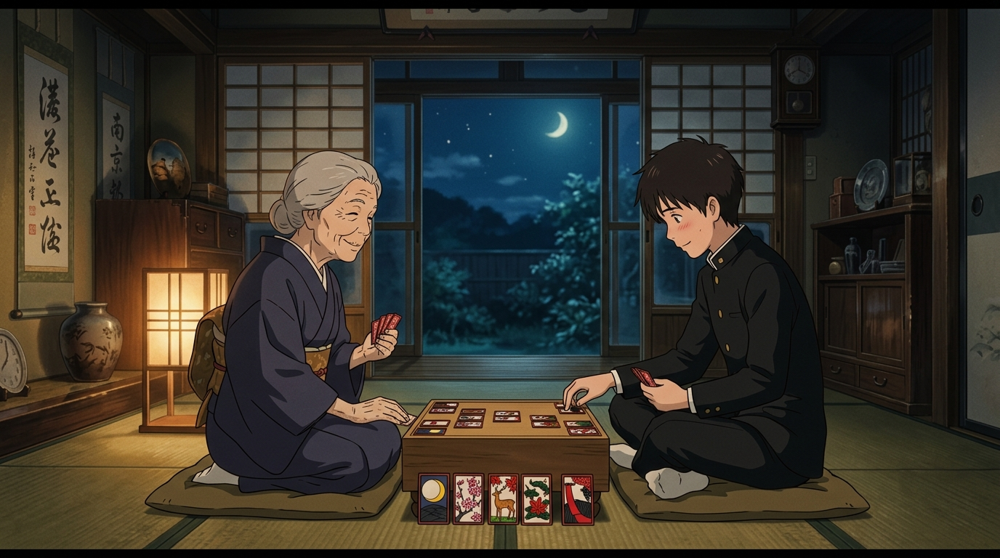

# 🖼️ 破曉前的最後花札賭局 (The Final Koi-Koi Before Dawn)

在薙刀風暴與喧囂散去後的深夜，陣內家和室恢復了深謐。榮奶奶盤坐在矮几前，鋪開了那盒承載著家族記憶的花札，微笑著向靦腆的少年發出邀請：「お前さん、花札は知ってるかい？（你……知道花札嗎？）」。

月光灑在榻榻米上，一張張繪有松、櫻、芒、鹿的精美牌面在指尖翻轉。奶奶一邊打出「こいこい」，一邊用最雲淡風輕卻重逾千鈞的語氣立下賭注：「如果我贏了……夏希那孩子就拜託你了。」面對自卑少年那句「我還沒有自信」，奶奶以洞察靈魂的平靜目光給予了終極信任：「只要是你一定能做到的。」翻出決勝牌的「私の勝ち」成了奶奶生前最後的勝利與託付。當破曉晨光照亮長廊，定海神針已悄然遠去，留給少年的，是手心中不可推卸的承諾與勇氣。

