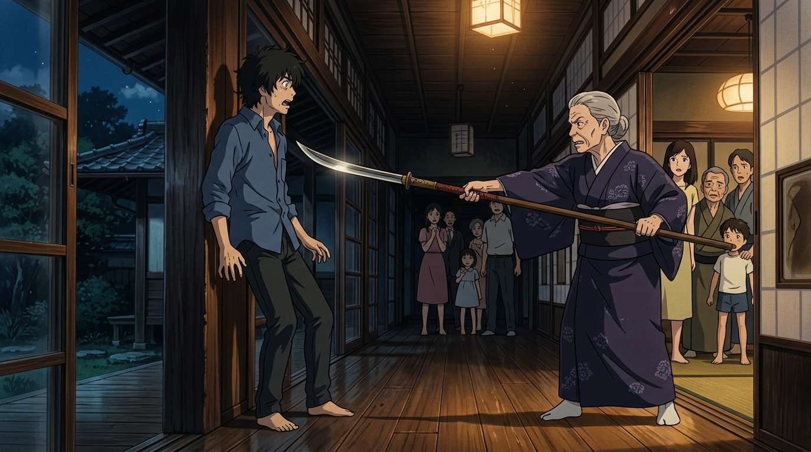

# 🖼️ 薙刀與決絕家訓 (The Naginata and Unyielding Family Iron)

侘助以為自己帶回了榮耀與財富——他向美軍販售具備「純粹知識欲」的 AI 換來天價收購，渴望以此向養育他的奶奶證明自己。然而，當他狂妄自白「那是我開發的」時，他所面對的不是長輩的誇讚，而是陣內家六百年武士家風最凜冽的審判。

榮奶奶默默走進和室內堂，取下牆上的古董長柄薙刀。刀刃泛著幽寒月光，直直刺向侘助的咽喉。一句震徹長廊的怒斥「ワビスケ、今ここで死ね！（侘助，你現在立刻給我死在這裡！）」瞬間粉碎了養子的所有幻想。在侘助狼狽逃奔後，奶奶收刀立威，向全家族下達了無可動搖的動員令：「いいかお前たち、身内がしでかした間違いは、みんなでケリをつけるよ！（自家人犯下的過錯，所有人一起負起責任把它了結！）」——這不是外人的災難，而是陣內家必須共同扛起的命運。

