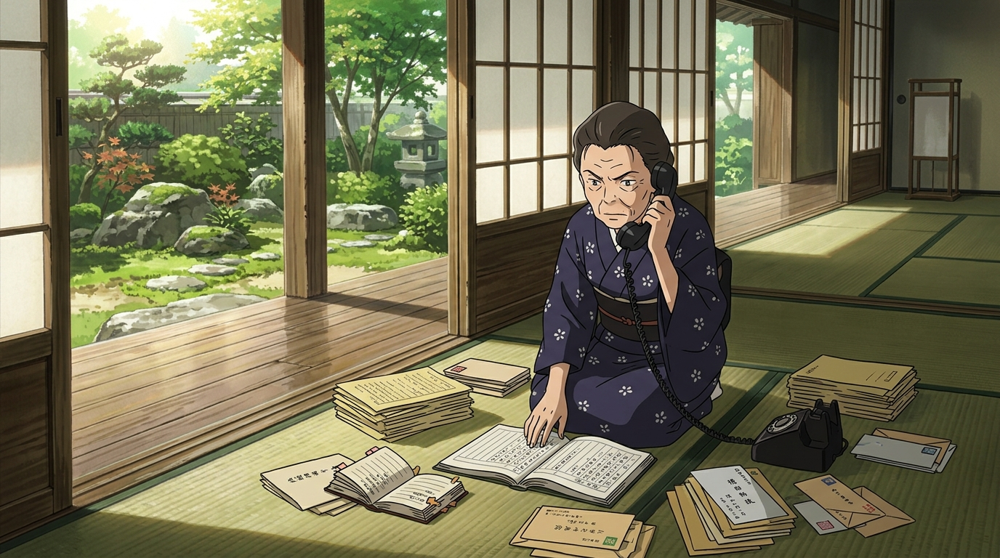

# 🖼️ 陣內榮的肉身通訊網 (Sakae's Physical Phone Network)

當 Love Machine 竊取管理員權限、讓掌控全日本水電、消防、交通與醫療的 OZ 系統陷入全面癱瘓時，現代數位社會的脆弱性暴露無遺。然而，在長野上田的陣內家大宅深處，九十歲的榮奶奶卻以最原始也最強悍的方式發動了反擊。

奶奶端坐於榻榻米上，身旁散落著泛黃的手寫通訊簿、人名電話帳與一疊疊信件。她手握沈重冰冷的黑色轉盤電話，一通接一通撥向警政廳長、消防署長、自衛隊高層與金融界故交。她不用演算法下令，而是喚出每一個人的名字，用沉穩鏗鏘的嗓音說出「諦めないことが肝心だよ（絕不能放棄）」與「あんたならできる（只要是你的話一定能做到）」。在虛擬世界崩潰之際，這套由人名、信任與一生交情構築的肉身網絡，成了維繫整個國家運轉的唯一基礎設施。

