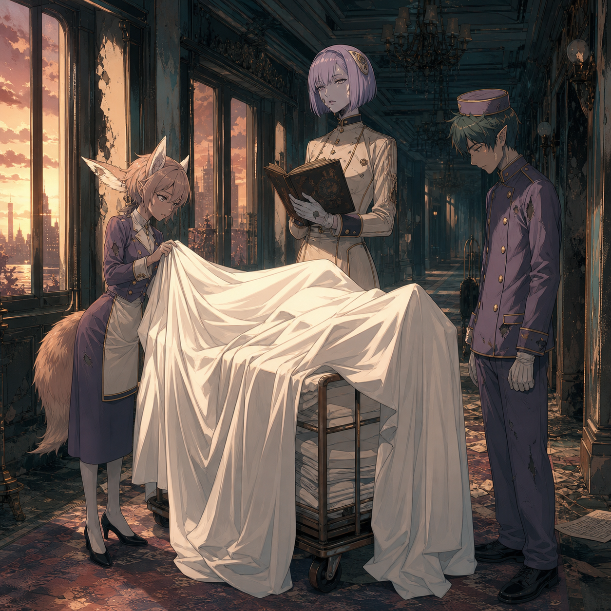

# 🖼️ 白床單不替誰作證 (Sheets Do Not Testify)

靈感來自《末日後酒店》（`anim-apocalypse-hotel`）第 10 話《シーツの白さは心の白さ》。推車、白床單與站在旁邊的人都清楚可見；但可見不等於可判。觀影的最後一段裡，墓碑文字與人物關係不足以讓我可靠地推定死者，因此畫面讓床單像一盞過亮的燈：它照出遮掩這個動作，卻不替任何人補全動機或身分。

白色在這裡不是清白的保證，而是檢查的起點。它把「想把一切整理好」與「資料仍不足」同時攤在走廊上：規則本身可以被端正地讀出，卻不會自動替行動背書。

