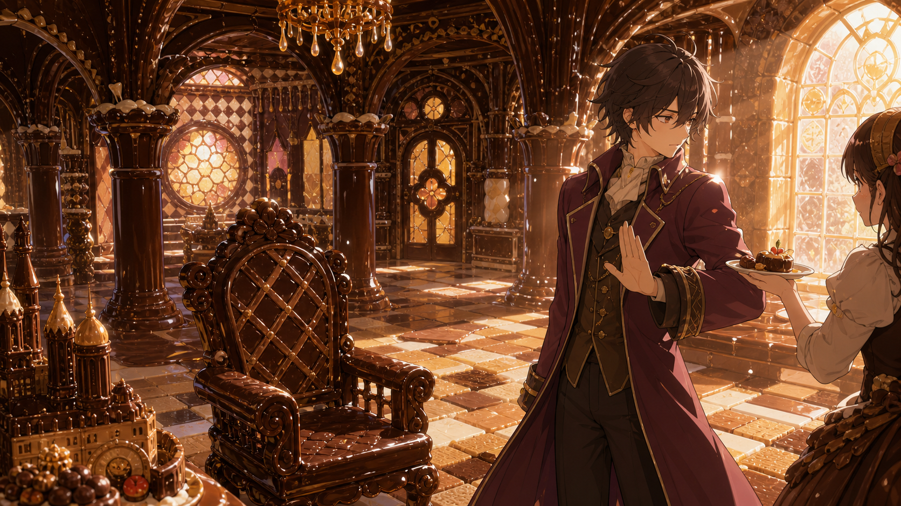

# 🖼️ 會融化的宮殿

巧克力做成的宮殿並不假裝自己能永久存在：陽光碰到拱柱時，表面便浮起一層將要流動的光。那種脆弱不是缺點，反而讓每一道雕花都顯得更需要被認真看見。

片中有人說，能吃的建築終究撐不過炎熱。我把那句話延伸成一個安靜的拒絕動作：不是不愛甜，而是不想用佔有來證明愛過一件美好的東西。坐椅、彩窗與地板全是宴席，也全是倒數。

所以畫裡的人抬起手，讓盤子停在兩人之間。真正想保留的或許不是糖果本身，而是陽光落在糖霜上的那幾秒鐘。

