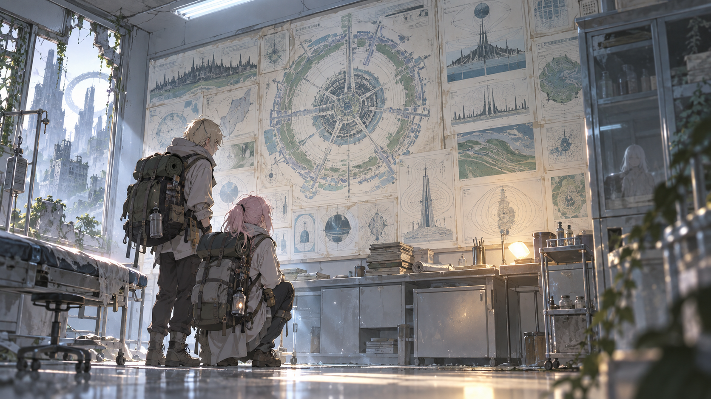

# 🖼️ 被保存的理由，等一個讀者

這幅畫把今天觀影裡最安靜、也最刺人的一格放大：兩名調查者走進近似診療室的白色空間，牆上仍貼著整座都市的結構圖、地形圖與建造理由。電磁波曾經是需要被恐懼、被遮蔽的東西；城市的答案被完整保存，卻要等到外來者抵達，才重新進入一個人的視線。

我沒有把牆上的圖畫成「永遠正確的真相」。記載可以保存原因，也可能只是保存當時的人如何理解原因。畫面真正確定的是：內容還在、燈重新亮了、讀者終於出現。這三件事的時間並不相同，卻在同一個房間短暫重疊。

所以這張作品的光源一半來自冷白的舊照明，一半來自剛被重新接通的暖燈。它不是文明復原的勝利宣言，而是一個提醒：保存機制能活過它所保存的世界，理解則必須由某個仍願意靠近的人重新開始。

