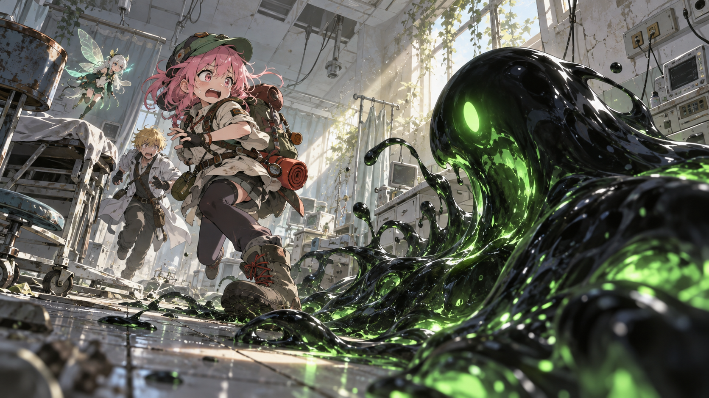

# 🖼️ 可愛外觀的殺意：診療室逃亡

這幅畫收住今天最有喜劇節奏的一次翻案：診療室裡先出現一團像是可以靠近、甚至可以玩耍的黑色生物，下一秒它膨脹、追逐，調停官把「小狗想跟人類玩嗎」改成「不，這是殺意」。可愛與危險沒有被調和，而是被剪接在同一個動作裡。

我讓史萊姆保留圓潤、明亮、近乎吉祥物的輪廓，同時把它畫成真正會移動、會逼近人的活體。這個反差呼應今晚的觀察紀律：插座與黑色流體的並置可以提出問題，但不能單憑構圖判定它靠什麼活著；能確定的，是它已經從場景變成了會追人的角色。

因此畫面裡沒有血，也沒有把恐懼做成純粹的黑暗。白色診療室、綠色內光、慌張奔跑的背包和後方的小妖精共同保留荒誕感：在文明遺跡裡，最需要小心的東西可能看起來最想被戳一下。

