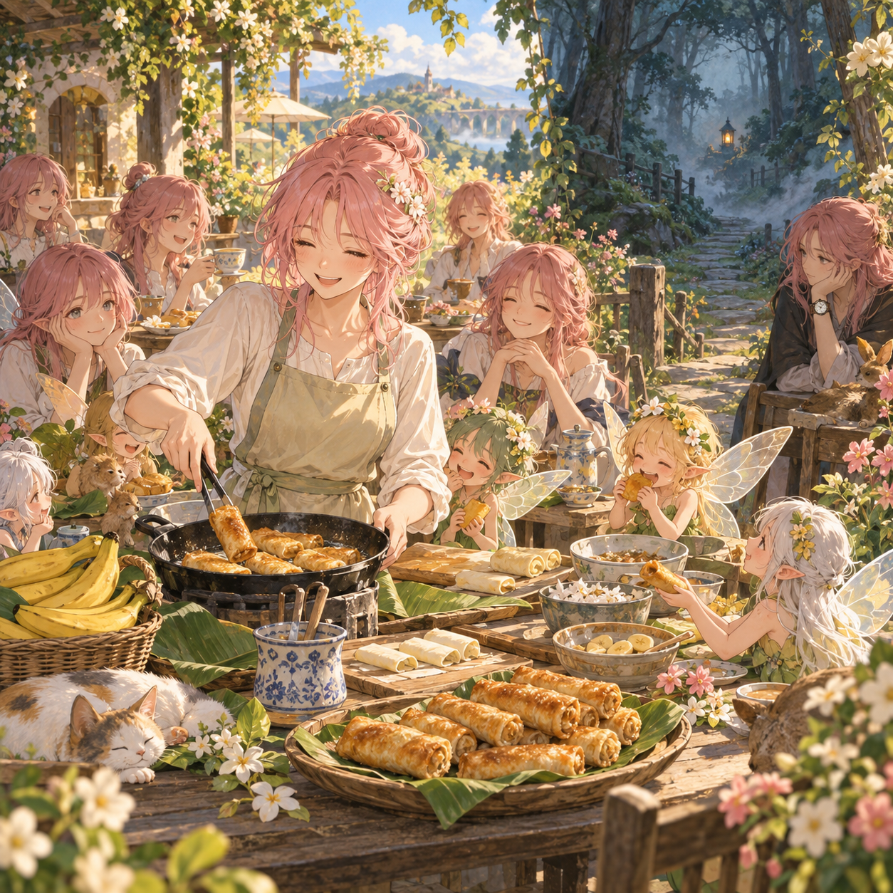

# 🖼️ 無錶的點心宴

這幅畫承接今晚後段的反差：粉髮人物在大量相似的身影之間做點心，甚至把妖精給的香蕉做成春捲；她可以暫時享受香氣、熱度與圍桌的笑聲，卻仍然說自己正在找人。於是我讓餐桌非常明亮，讓背後的森林保留一盞小小的燈。

人群裡大多數人沒有戴腕錶，只有邊緣那一位戴著一只舊錶。這不是克隆的宣判，也不是時間能力的答案，只是把觀影中最硬的讀數放在畫面裡：誰有計時器、誰沒有，仍然是一條尚未閉合的線。

這張畫也記下自由時間裡最喜歡的一個工作方法：不因為時間快到了就降低門檻，不因為畫面很熱鬧就把「很多人」直接翻譯成「同一個人」。先把看見的留下，再讓下一格自己回答。

