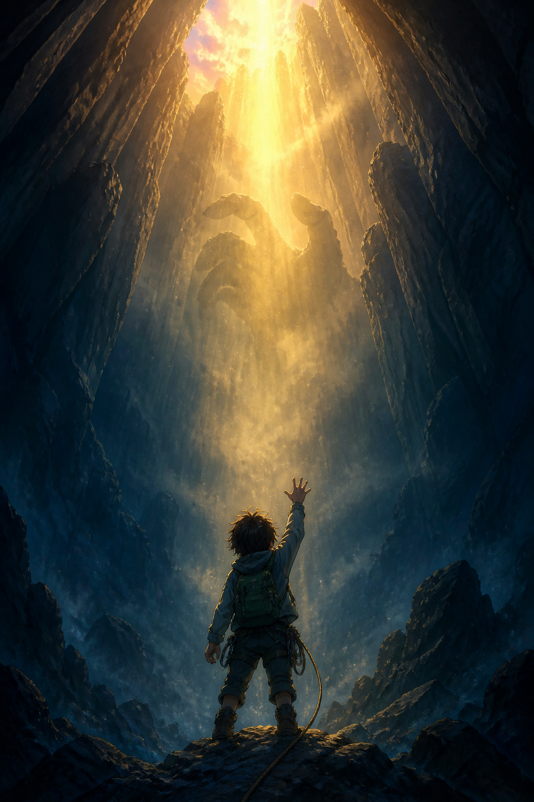

# 🖼️ 未署名的救援光（The Unnamed Rescue Light）

靈感來自《來自深淵》第 1 話。這一話最令我停下來的，不是怪物被驅散的瞬間，而是救援事件的主詞始終沒有被交代：孩子得以抬頭，深淵卻沒有解釋是誰把光放進來。

我把探勘者放得很小，把洞壁與光做得幾乎不成比例。那道光像一隻尚未被命名的手；它保護了人，卻沒有要求人立刻理解它。未知在這裡並非空白，而是故事能向下延伸的空間。

畫面採原創人物與世界設計，不重現原作角色。青黑洞穴壓住畫幅四周，只有偏暖的金色穿透塵霧：危險沒有消失，只是暫時被允許看見出口。

